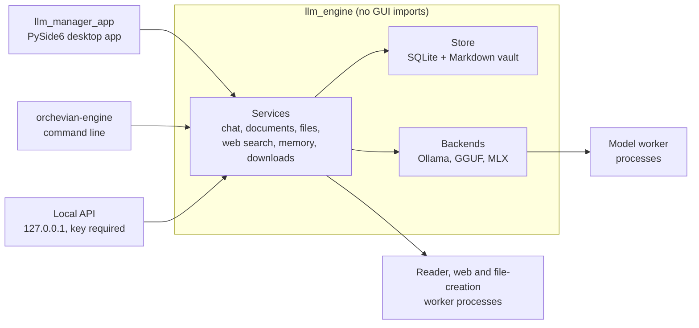

# Orchevian design

How Orchevian is built and why. For using the app, see the
[user guide](docs/user-guide.md); for development tasks, see
[docs/development.md](docs/development.md). The original rebuild plan is kept in
[docs/history](docs/history/redesign-plan.md).

## Principles

1. **Local first.** Models, chats, files and notes stay on the user's computer. The
   network is used only for what the user asks: web search for a message, and model
   browsing or downloads.
2. **Untrusted by default.** Web pages, documents, model output and downloads are
   treated as untrusted. Anything that parses them runs in a disposable process with
   limits, and model output can't execute anything.
3. **Never stuck.** Model runtimes run in separate processes, so a frozen model can
   always be stopped without closing the app.
4. **Calm, native feel.** Apple-style restraint: clear hierarchy, instant response to
   input, and motion only where it explains what happened.
5. **Honest limits.** When something can't be done (no relevant sources, a runtime is
   missing, a service is busy) the app says so instead of guessing.

## Architecture

The code is split in two packages with a strict boundary:

- **`llm_engine`**: everything that isn't the interface. It never imports PySide6, so the
  command line and local API share it.
- **`llm_manager_app`**: the PySide6 desktop app. It talks only to engine services, and
  never imports SQLite, model runtimes, FastAPI or Hugging Face libraries directly.

### Engine services

| Service | Responsibility |
| --- | --- |
| `ChatService` | Saves the user's message, runs generation on a worker thread, streams tokens, saves the reply. Adds the date note, project guidance, document excerpts, Second Brain notes and web evidence to one leading system message. |
| `ModelSession` | Holds the one loaded model; loads, unloads and force-stops it. |
| `CatalogService` | Lists installed models from all backends. |
| `DocumentService` | Imports attachments and project files, extracts text in a worker process, and selects bounded excerpts for each reply. |
| `ArtifactService` | Asks the model for a validated file specification and writes Word, PDF, Excel, PowerPoint, HTML, chart and data files in a worker process, with versions. |
| `WebSearchService` | Runs web search for a message and keeps the evidence used. |
| `memory.capture` | Extracts grounded notes from a finished chat into the Second Brain vault. |
| `DiscoveryService`, `DownloadService` | Search Hugging Face and Ollama, estimate fit to the computer's memory, and download with checksum verification. |
| `ApiServerService` | The optional OpenAI-compatible API, sharing the chat model session. |

### Processes and threads

| Where | What runs there |
| --- | --- |
| GUI thread | The interface only. It never waits on a model, file or network call. |
| Qt worker threads | Chat and catalog workers that call engine services. |
| Model worker process | The active model runtime (Ollama client, llama.cpp, or MLX). Stopping kills it. |
| Short-lived worker processes | Document and image reading, OCR, web page reading, and file generation, each with a deadline. |

Worker processes use `spawn`, receive only the data they need (no database handles or
file paths beyond their input), and are killed at their deadline or on cancel.

### Model runtimes

| Runtime | Availability |
| --- | --- |
| Ollama | Talks to the user's local Ollama service. All platforms. |
| GGUF | `llama-cpp-python` (optional `gguf` extra). All platforms. |
| MLX | `mlx-lm` (optional `mlx` extra). Apple Silicon only. |

A missing runtime shows as unavailable with setup guidance; it never crashes the app.
Loads and the first response time out after 120 seconds; a stream that stalls for 60
seconds is stopped. Chat templates require a single leading system message, so every
feature that adds context merges into it rather than adding another.

## Data

| Data | Where |
| --- | --- |
| Chats, projects, attachments, created files, search evidence | SQLite database `data.db` (WAL mode), in the data folder |
| Second Brain notes | Markdown files in `second-brain/`; files are the source of truth |
| Model folder and API port | `config.json` |
| Interface preferences | Qt settings |
| Search and API keys | System password vault via `keyring`; owner-only settings file where no vault exists |

The data folder is `~/.local/share/orchevian` (an existing `~/.local/share/llm-manager`
library is used in place). On macOS and Linux it is owner-only (`0700`, files `0600`).
The schema changes only through numbered, additive migrations
(`src/llm_engine/store/migrations`), applied on startup; a library from before the
migration system is backed up first. Private Chat is never written to disk.

## Feature design

### Documents and project files

Imports accept PDF, DOCX, XLSX, CSV/TSV, text, Markdown and images, up to 20 MB and 20
files per chat or project, with 200,000 extracted characters per file. Each reply gets at
most 8,000 characters of source excerpts, chosen by relevance and cited by location.
Pictures and scanned PDF pages use local OCR (Tesseract) and, for Ollama vision models,
up to four page images per reply.

### Creating files

The model returns a `create_documents` JSON specification, which is validated against a
strict schema before native writers run in a worker process. One repair attempt is
allowed. Spreadsheet formulas may use only basic math functions and local cell
references; CSV text that looks like a formula is escaped; file names can't contain
paths. Up to eight files per request and 80 versions per chat are kept.

### Web search

Off by default and chosen per message. The current question (up to 500 characters) is
turned into a focused query: filler words removed, dates spelled out, and follow-ups
that lack a subject borrow it from a recent question. Services are tried in order:
the user's own keys (Exa, Serper, Tavily, Brave Search), then Exa's free keyless
search. Search engines' results pages are never scraped. Up to ten candidates are
checked, and a page is used only if it mentions every named subject in the question and
enough of its topic; at most three pages and 8,000 characters reach the model, marked as
untrusted reference data. Page reading runs in a worker process that accepts only public
addresses, re-checks redirects, and stops after 45 seconds.

### Second Brain

Notes are Markdown with `[[wiki links]]`, backlinks and a graph view. Capture uses the
chat's own model, requires an exact quote from the conversation as evidence, and runs
only when the model is idle. Relevant notes (up to four) are recalled into later chats.

### Local API

`GET /v1/models` and `POST /v1/chat/completions`, OpenAI-compatible. Off by default,
bound to `127.0.0.1`, and protected by an API key, host-name checks against DNS
rebinding, rejection of browser origins, and size limits. It shares the one model
session with chat, so a busy session answers with HTTP 429.

## Interface

The interface follows Apple's design language.

- **Layout:** a sidebar (chats, models, Second Brain, templates, projects) and one main
  workspace. Settings and project homes open inside the workspace, not as separate
  windows.
- **Visual tokens** live in `llm_manager_app/tokens.py`: a light and a dark palette,
  control radius, system font, and one compact stylesheet. Hover is quieter than
  selection; every control responds when pressed; status notices are neutral and errors
  softly tinted.
- **Motion** lives in `llm_manager_app/motion.py`: one strong ease-out curve, 160 ms
  entrances and 110 ms exits. Only occasional, spatial moments animate (the downloads
  popover and the activity pill). Frequent and keyboard actions are instant. The system
  Reduce Motion setting makes every fade instant.
- **Streaming:** replies render as Markdown while they arrive. Tokens are batched every
  80 ms and only the streaming reply is re-rendered, so updates stay fast in long chats.
  Model text can't insert raw HTML, images or non-web links.
- **Activity:** a pill at the top shows what the model is doing, with elapsed time and
  Stop. It appears only for work longer than 300 ms.

## Security

See [docs/security.md](docs/security.md) for the full security model and its known
limits.

## Distribution

Desktop builds use PyInstaller from a separate environment, so development extras can't
leak in. Each build runs its own smoke check (eleven checks, including a real local API
listener and the app icon) outside the source checkout before packaging:

| Platform | Download |
| --- | --- |
| macOS | `.dmg` with the app and an Applications shortcut; the app inside the mounted image is smoke-checked again |
| Windows | Inno Setup installer, per-user (no administrator prompt), with Start menu and desktop shortcuts |
| Linux | AppImage |

Every build includes `LICENSE` and generated `THIRD_PARTY_NOTICES.txt`. Pushing a version
tag runs `.github/workflows/release.yml`, which builds all three and publishes a GitHub
Release. Builds are not yet code-signed, and model runtimes other than Ollama are not
yet bundled. See [packaging/README.md](packaging/README.md).

## Testing

- `pytest` covers the engine and the interface (Qt offscreen), with fake model backends
  and temporary data; CI runs it on macOS, Windows and Linux.
- Real-model checks (`scripts/check_*.py`) exercise installed models and live search
  against a temporary library.
- `scripts/preview_ui.py` renders every screen in both themes with sample data.
