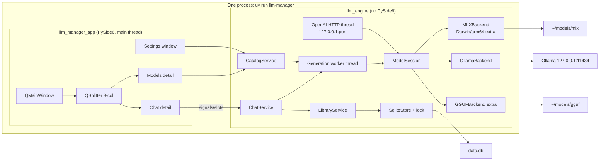
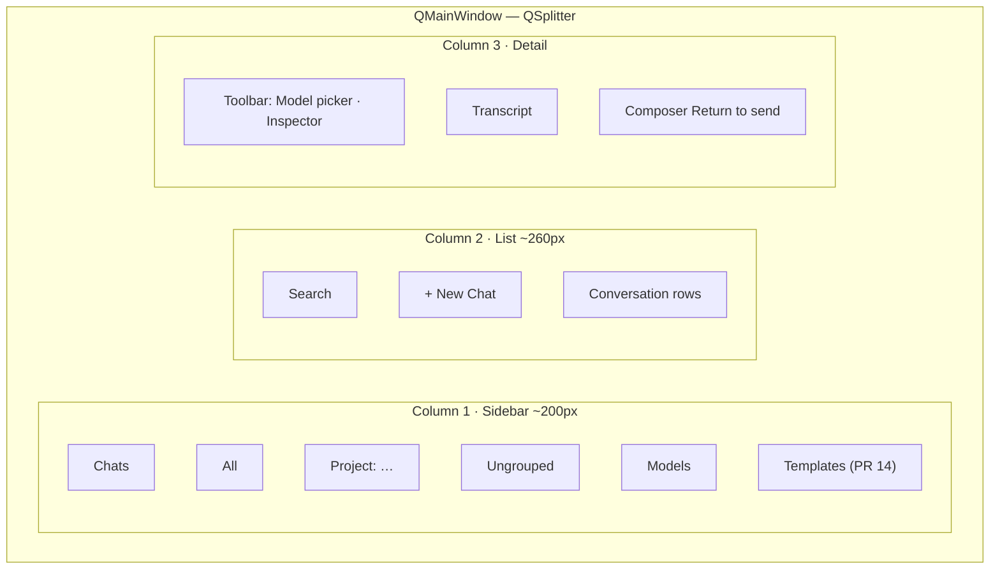

# LLM Manager: Greenfield Redesign

| Field | Value |
| --- | --- |
| **Status** | Draft (rev 6) |
| **Author** | Grok (for Seth Hardin) |
| **Date** | 2026-09-02 |
| **Revision** | 6 — Seth reversed SwiftUI: one Python codebase, new PySide6 GUI, in-process `llm_engine`, macOS + Windows + Linux |
| **Product** | LLM Manager — local-first desktop app for running LLMs on this machine |
| **Workspace** | `/Users/sethhardin/llm-manager-ai` |
| **Legacy (read-only)** | `/Users/sethhardin/dev/llm-manager/llm-manager-ai` (themed Qt), `/Users/sethhardin/dev/llm-manager/llm-manager-human` (original Qt) |
| **Existing data** | `~/.local/share/llm-manager/data.db` — migrate, do not wipe |

This is a new product and a new codebase. It is not a restyle of `chat_page.py`. The legacy trees are a capability inventory and a list of mistakes.

---

## Overview

LLM Manager is a personal, local-first desktop app for discovering, loading, and chatting with large language models on this machine. It is not a multi-user SaaS, not a cloud wrapper, and not a themed experiment.

The current app failed as a *product*, not as a missing stylesheet. Two Grok sessions tried to rescue a Claude-built PySide6 GUI by restyling it; both made the information architecture and the visual system worse. Chat, projects, settings, models, templates, and the API server were stuffed through a chat-centric shell (`ChatPage.attach_settings` in [`main_window.py`](/Users/sethhardin/dev/llm-manager/llm-manager-ai/src/llm_manager/gui/main_window.py)). Inference, SQLite, and uvicorn lifecycle leaked into widgets. `chat_page.py` is 1,337 lines and owns the sidebar, the conversation tree, the HTML-table transcript, the composer, and a settings stack.

This redesign is **one Python 3.13+ codebase**:

1. **`llm_engine`** — a library (no PySide6 import) that owns models, backends, SQLite, downloads, ChatService, and the optional OpenAI-compatible HTTP server.
2. **`llm_manager_app`** — a **new** PySide6 GUI that talks only to those services. It never opens sqlite3 itself, never imports `mlx_lm` / `llama_cpp`, and never starts uvicorn.

Same process. Qt main thread never calls `stream_generate` or `mlx_lm.load`. One generation worker thread plus queued signals.

GUI platforms: **macOS, Windows, Linux.** Backends: Ollama everywhere; GGUF optional extra; MLX optional extra on Darwin/arm64 only.

v1 ships: model list + select, new chat, streaming reply, conversation list with rename/delete, project grouping, system prompt, generation presets, settings for model dir / API, and an in-place migration of `data.db`.

---

## Key Decisions

| # | Decision | Rationale |
| --- | --- | --- |
| K1 | **Greenfield rebuild** in `/Users/sethhardin/llm-manager-ai`. Do not copy `chat_page.py`, `theme.py`, `native_glass.py`, or the QSS. | Two restyle sessions failed. The foundation is the problem. |
| K2 | **Option A: new PySide6 GUI + in-process `llm_engine`.** Not SwiftUI. Not a browser/Tauri/Electron shell. Not two GUIs. | Seth requires a GUI on Linux, Windows, and Mac (2026-09-02, reversing the Swift pick). MLX is a Mac-only *backend extra*, not a reason to lock the GUI. |
| K3 | **Python package is `llm_engine`**, product name is **LLM Manager** for v1. GUI package is `llm_manager_app`. | Marks the break from `llm_manager`. Seth confirmed keep the name. |
| K4 | **GUI ↔ engine is in-process Python** (typed service methods, not JSON-RPC). Optional OpenAI HTTP is a *separate* loopback listener the engine owns. | One process, one language. `llm-engine serve` is only the OpenAI API, not a GUI control plane. |
| K5 | **Three-column shell** (QSplitter): sidebar · list · detail. | Notes / Mail pattern. Not a website. Not a settings dump inside the chat page. |
| K6 | **Settings as a separate window** (⌘, / Ctrl+,). Per-chat system prompt and sampling live in a chat inspector, not in Settings. | The old app hid Models/Storage/Templates/Server/Appearance behind a “mode” menu on the chat rail. |
| K7 | **Visual system “Studio”**: system UI font, 8–10px radii, six named colors + selection/separator, no brass, no capsules, no liquid glass. Small Qt token/QSS module — not 742-line `theme.py`. | Distinctive by restraint. One signature: the streaming caret. Qt will not feel like Notes; native widgets + a hard service boundary are the mitigation. |
| K8 | **`list_conversations()` returns summaries, never messages.** Messages load per conversation. | Old `database.list_conversations()` joins every message of every chat. |
| K9 | **Explicit `load` / `unload` with a single loaded model cache.** `stream_generate` does not reload weights. | `MLXBackend.stream_chat` calls `mlx_lm.load()` on every send. `GGUFBackend` constructs a new `Llama()` on every send. |
| K10 | **Backend errors propagate.** Ollama-down is a visible status, not an empty list. | `backends.list_all_models()` swallows all exceptions. |
| K11 | **API `stop()` must stop uvicorn.** Engine holds a `uvicorn.Server` and sets `should_exit`. | `api_server.stop()` only flips `_server_running`. |
| K12 | **Migrate `data.db` in place.** Path is `Path.home() / ".local" / "share" / "llm-manager" / "data.db"` **on all OSes** for v1. | One conversation already lives there. Do not fork a Windows `%APPDATA%` path in v1. |
| K13 | **GUI is macOS + Windows + Linux.** App Sandbox off. Not MAS. | Seth’s requirement. MLX extra is Darwin/arm64 only; missing extra → unavailable, no crash. |
| K14 | **Ollama is the first-class backend.** | This machine’s library today is four Ollama tags and empty `~/models/{mlx,gguf}`. |
| K15 | **Engine PRs first. Do not start GUI PRs until ChatService (PR 5) exists.** Fallback if the GUI slips: `llm-engine chat` TTY. | Domain logic is independently testable. We do not “just throw a window up.” |
| K16 | **No dedicated Server page.** OpenAI **endpoint** in PR 6 + Settings → API tab in PR 12b. Templates stay **off the sidebar until PR 14** (not a v1 blocker). | Seth confirmed 2026-09-02. |
| K17 | **One `QMainWindow`.** PySide6 ≥ 6.7, Qt 6. No Swift `WindowGroup`. | One generation globally. |
| K18 | **No sidecar.** Quit closes the Qt app, cancels/joins the generation worker, stops uvicorn via `should_exit`. | One process. |
| K19 | **Engine settings live in `config.json`** (`model_dir`, `api_port`). Host hardcoded `127.0.0.1`. GUI chrome (theme, inspector open, last conversation id, Return-to-send) in `QSettings`. | Model dir and API port are engine state. |
| K20 | **Service interfaces + pytest are the contract.** No Swift Codable, no JSON-RPC golden fixtures. | `backends/protocol.py` + ChatService / LibraryService / CatalogService signatures. |
| K21 | **Python is the only inference host.** No mlx-swift. No split backends across languages. | Ollama + HF + FastAPI + the GUI are all Python. |
| K22 | **GGUF `n_ctx` is a load option (default 8192), not `GenerationParams.max_tokens`.** Ollama cancel = close the HTTP body. | Old GGUF set `n_ctx=params.max_tokens` (often 2048). |
| K23 | **Return sends, Shift+Return newline.** Settings can flip to Ctrl/⌘+Return. | Seth confirmed 2026-09-02. |
| K24 | **App icon with later packaging, not v1 `uv run`.** | Seth confirmed 2026-09-02. |

---

## Background & Motivation

### What the app is supposed to do

Jobs to be done, carried forward:

1. Discover, download, and inspect local models (MLX, GGUF, Ollama).
2. Chat with a selected local model (streaming, system prompt, temperature / top_p).
3. Organize chats and projects (a project is a folder of chats that also seeds instructions + default model).
4. Prompt templates.
5. Optional local OpenAI-compatible HTTP API bound to 127.0.0.1 so other tools can talk to the loaded model.
6. Storage / disk usage for downloaded models.

Audience: a technical user (Seth) who already has models on disk — in practice via Ollama — and wants a calm desktop app, not a dashboard. The GUI must run on the machines he uses, not only a Mac.

### Current state (legacy, cited)

Two trees, same engine, different chrome:

| | Human tree | AI tree |
| --- | --- | --- |
| Path | `/Users/sethhardin/dev/llm-manager/llm-manager-human` | `/Users/sethhardin/dev/llm-manager/llm-manager-ai` |
| GUI | PySide6, sidebar groups in `MainWindow` | PySide6, everything stuffed into `ChatPage` |
| Theme | “Claude-Desktop-calm / dark academia” | “Lamp-glass over a reading room” + `pyqt-liquidglass` |
| Lines | slightly smaller GUI | **~4,925 Python lines; ~4,050 GUI / ~870 engine** (approximate) |

Engine (shared shape, ~870 lines, actually useful):

- [`config.py`](/Users/sethhardin/dev/llm-manager/llm-manager-ai/src/llm_manager/config.py) — `~/models`, `~/.local/share/llm-manager/data.db`, API `127.0.0.1:8080`
- [`models.py`](/Users/sethhardin/dev/llm-manager/llm-manager-ai/src/llm_manager/models.py) — `LocalModel`, `ChatMessage`, `Conversation`, `Project`, `PromptTemplate`
- [`database.py`](/Users/sethhardin/dev/llm-manager/llm-manager-ai/src/llm_manager/database.py) — sqlite3 module-level CRUD
- [`backends/`](/Users/sethhardin/dev/llm-manager/llm-manager-ai/src/llm_manager/backends) — MLX, Ollama, GGUF
- [`hub.py`](/Users/sethhardin/dev/llm-manager/llm-manager-ai/src/llm_manager/hub.py) — Hugging Face search/download
- [`api_server.py`](/Users/sethhardin/dev/llm-manager/llm-manager-ai/src/llm_manager/api_server.py) — FastAPI `/v1/models`, `/v1/chat/completions`

This machine, 2026-09-02:

- `data.db`: 1 conversation (`id=4`, title `"New Chat"`, model `deepseek-coder-v2:16b` / `ollama`), 0 messages, 0 projects, 0 templates, 0 favorites. `project_id` is a trailing ALTER column. `sqlite_sequence` is `conversations=8`, `messages=10`, `projects=3`.
- `~/models/mlx` and `~/models/gguf`: empty.
- Ollama at `127.0.0.1:11434`: `qwen2.5-coder:14b`, `deepseek-coder-v2:16b`, `qwen3.8:27b-mlx`, `qwen3:8b`.

### Why restyling failed

Session 1 (2026-09-01): “aesthetic is not good. The interface is not user friendly and I find it difficult to use.”

Session 2 (2026-09-02): polish, then Apple “liquid glass” via `pyqt-liquidglass` + `NSVisualEffectView`. Too rounded, not see-through, then disjointed. Theme copy drifted into walnut / brass / lamp-glass.

This session: complete redesign. Rev 5 picked SwiftUI; Seth reversed that because the GUI must run on any OS. **The engine correctness bar from rev 5 still stands.** We do not copy the old GUI.

### Concrete mistakes to not repeat

**Architecture**

- GUI owns inference (`InferenceThread` constructed by `ChatView._start_inference`).
- GUI owns the DB: `ChatView._conv()` is `next((c for c in db.list_conversations() if c.id == self.conv_id), None)`.
- GUI owns server lifecycle (`ServerPage._toggle_server`).
- Module-level singletons; unused `typer`; `main()` only launches Qt.

**Correctness**

- `list_conversations()` always `_load_messages` for every row.
- `_connect()` runs schema + migrate on every call; new connection per helper.
- `list_all_models()`: `except Exception: pass`.
- `api_server.stop()` only clears a boolean.
- MLX and GGUF reload the full model per prompt.
- `hub.pull_mlx` / `pull_gguf` accept progress callbacks and never fire them.
- Tests: `tests/test_smoke.py` is `assert True`.

**UI**

- Transcript is HTML tables inside `QTextEdit`. Streaming rebuilds the entire HTML document every 80ms.
- `paintEvent` punches a transparent hole for `NSVisualEffectView`.
- Appearance, models, storage, templates, and the API server are not first-class surfaces.

Rev 6 still forbids copying those widgets. The new GUI is a *new* PySide6 app behind a service boundary.

---

## Goals & Non-Goals

### Goals (v1 must-have)

- Desktop app on **macOS, Windows, and Linux**: sidebar + list + content, menu bar, Settings window.
- Engine/UI split: `llm_engine` does not import PySide6. GUI does not import sqlite3, `mlx_lm`, `llama_cpp`, fastapi, or huggingface_hub.
- Model catalog: list MLX (when extra present on Darwin/arm64), GGUF (when extra present), Ollama; select one; show availability errors.
- Chat: new conversation, streaming on a background thread, stop, regenerate, system prompt, Precise/Balanced/Creative, temperature / top_p / max_tokens.
- Conversations: list, search-by-title, rename, delete, persist.
- Projects: folder + instructions + default model; delete keeps chats (`ON DELETE SET NULL`).
- Settings: model directory and API port in `config.json`; appearance in `QSettings`.
- Migrate existing `data.db` without wiping Seth’s row or resetting `sqlite_sequence`.
- Tests of domain logic (conversations, migration, FakeBackend, ChatService, API start/stop), not `assert True`.
- UI never blocks on inference, load, or download.
- Launch: `uv run llm-manager` (and `uv run llm-engine chat` as TTY fallback).

### Nice-to-have in v1 if cheap

- Prompt templates (hidden from sidebar until PR 14).
- Favorites / pinned models.
- Hugging Face search + download with real progress.
- OpenAI-compatible API with working start/stop + Settings → API tab (not a Server page).
- Storage summary.

### Non-goals (v1)

- Cloud accounts, sync, multi-user, auth.
- SwiftUI, WKWebView, Tauri, Electron, two GUIs.
- Copying `chat_page.py` / `theme.py` / `native_glass.py`.
- JSON-RPC Unix-socket control plane for the GUI.
- Mac App Store / sandboxed distribution.
- Plugin marketplace, tool-calling, agents, RAG, embeddings.
- Side-by-side model comparison.
- Mobile.
- Bundled runtime / PyInstaller as a v1 gate (v1.1).
- VoiceOver / reduced-motion as a v1 gate.
- Dual-writing `data.db` with the old Qt app. Quit the old app before live `uv run llm-manager`.

---

## Tech Choice

### Option A — New PySide6 app, in-process `llm_engine` *(chosen)*

**What it is.** Python 3.13, uv, PySide6 ≥ 6.7 for a *new* GUI. Engine is a library in the same process. Backends stay Python.

**Pros**

- One language, one toolchain, one `uv run` on Mac, Windows, and Linux.
- Fastest reuse of MLX / Ollama / GGUF / FastAPI.
- Agents generate Python more reliably than Swift.
- Service layer can still be enforced: GUI imports `llm_engine.services`, never sqlite3.

**Cons**

- Qt will not feel like Notes. Mitigation: QListView / QPlainTextEdit / QTextBrowser, Studio tokens, modest QSS, **no HTML-table bubbles**, no `NSVisualEffectView`.
- Social (code review) rather than process isolation. Mitigation: `llm_engine` must not import PySide6; CI grep; pytest covers ChatService without Qt.

**Why A now.** Seth requires any-OS GUI. That is a product constraint, not inertia. The *old* PySide6 app is still the wrong foundation; we rebuild the GUI, we do not restyle it.

### Option B — SwiftUI Mac app + Python sidecar *(rejected)*

Best native Mac feel. Rejected: locks the GUI to macOS. Seth reversed this on 2026-09-02.

### Option C — Local web UI *(rejected)*

Conflicts with “desktop app.” FastAPI stays only as the OpenAI face of the engine.

### Recommendation

**A.** One Python codebase. New PySide6. In-process `llm_engine`. MLX is an optional extra on Apple Silicon, not the GUI platform.

---

## Proposed Design

### System architecture



Rules:

- `llm_engine` never imports PySide6.
- GUI never imports sqlite3, `mlx_lm`, `llama_cpp`, fastapi, huggingface_hub.
- Qt main thread never calls `stream_generate` or `ModelSession.load`.
- Only `SqliteStore` writes `data.db`. WAL, one connection, one lock.
- OpenAI server is optional; stopping it does not quit the GUI.

### Repository layout

```
/Users/sethhardin/llm-manager-ai/
  README.md
  DESIGN.md
  pyproject.toml
  src/llm_engine/                 # NO PySide6
    __init__.py
    __main__.py                   # llm-engine CLI
    cli.py                        # chat | models | serve | migrate | health
    config.py                     # config.json
    domain/{models.py, chat.py, errors.py}
    store/{schema.sql, sqlite.py, library.py, migrations/}
    backends/{protocol.py, registry.py, ollama.py, mlx.py, gguf.py, fake.py}
    services/{catalog.py, chat.py, session.py, hub.py, openai_api.py}
    logging.py
  src/llm_manager_app/            # PySide6 only; imports llm_engine.services
    __init__.py
    __main__.py                   # llm-manager GUI
    main_window.py
    tokens.py                     # Studio hex + small QSS
    widgets/{sidebar.py, conversation_list.py, chat_view.py, composer.py,
             transcript.py, model_picker.py, models_view.py, settings.py,
             inspector.py}
    workers.py                    # QThread adapter around ChatService
  tests/
    conftest.py
    test_library.py
    test_migrate.py
    test_session.py
    test_chat_service.py
    test_openai_api.py
    test_config.py
    test_engine_no_pyside.py      # fail if llm_engine imports PySide6
    fixtures/legacy_data.db
    fixtures/pre_project_id.db
```

Legacy trees stay read-only until parity; then archive.

Dev launch:

```bash
uv run llm-manager          # GUI
uv run llm-engine chat      # TTY fallback
uv run llm-engine serve     # OpenAI HTTP only
uv run llm-engine models
uv run llm-engine migrate
uv run llm-engine health    # print session + db + api status (in-process)
```

### Engine: domain types

These replace [`models.py`](/Users/sethhardin/dev/llm-manager/llm-manager-ai/src/llm_manager/models.py). They are the in-process types the GUI imports. Datetimes are naive ISO-8601 matching the live DB (`2026-08-28T11:39:57.313141`). Enums are lowercase (`"ollama"`). Presets are `"precise"|"balanced"|"creative"`; the UI title-cases them (old `chat_page.py:52-56` tuples, same numbers).

```python
# src/llm_engine/domain/models.py
from __future__ import annotations

from dataclasses import dataclass, field
from datetime import datetime
from enum import StrEnum
from pathlib import Path
from typing import Iterator, Protocol


class BackendName(StrEnum):
    MLX = "mlx"
    OLLAMA = "ollama"
    GGUF = "gguf"


@dataclass(frozen=True, slots=True)
class ModelRef:
    backend: BackendName
    name: str

    @property
    def id(self) -> str:
        return f"{self.backend}/{self.name}"


@dataclass(frozen=True, slots=True)
class LocalModel:
    ref: ModelRef
    path: Path | None
    size_bytes: int
    modified_at: datetime | None = None
    details: dict[str, str] = field(default_factory=dict)
    available: bool = True
    unavailable_reason: str | None = None


@dataclass(frozen=True, slots=True)
class LoadOptions:
    """GGUF context window. Default 8192. Not per-send max_tokens."""
    n_ctx: int = 8192


@dataclass(frozen=True, slots=True)
class GenerationParams:
    temperature: float = 0.7
    top_p: float = 0.9
    max_tokens: int = 2048

    @classmethod
    def preset(cls, name: str) -> GenerationParams:
        key = name.strip().lower()
        return {
            "precise": cls(0.2, 0.8, 2048),
            "balanced": cls(0.7, 0.9, 2048),
            "creative": cls(1.1, 0.98, 2048),
        }[key]


@dataclass(frozen=True, slots=True)
class ChatTurn:
    role: str  # "user" | "assistant" | "system"
    content: str
    tokens_per_sec: float | None = None  # stores chunks/s
    elapsed_s: float | None = None
    created_at: datetime | None = None


@dataclass(frozen=True, slots=True)
class ConversationSummary:
    id: int
    title: str
    model: ModelRef | None
    project_id: int | None
    message_count: int
    updated_at: datetime
    created_at: datetime


@dataclass(frozen=True, slots=True)
class Conversation:
    summary: ConversationSummary
    system_prompt: str
    messages: tuple[ChatTurn, ...]


@dataclass(frozen=True, slots=True)
class Project:
    id: int
    name: str
    instructions: str
    default_model: ModelRef | None
    created_at: datetime


class EngineError(Exception):
    code: str  # generating | no_model | not_found | load_failed | backend_unavailable | cancelled | config_invalid | bind_failed


class CancelToken(Protocol):
    def is_set(self) -> bool: ...


class LoadedHandle(Protocol):
    model: LocalModel


class InferenceBackend(Protocol):
    name: BackendName

    def is_available(self) -> tuple[bool, str | None]:
        """(ok, reason). Never raise for 'not installed' / 'daemon down'."""

    def list_models(self) -> list[LocalModel]:
        """Raise EngineError on unexpected failure. Empty list is valid."""

    def load(self, model: LocalModel, options: LoadOptions | None = None) -> LoadedHandle: ...
    def unload(self, handle: LoadedHandle) -> None: ...

    def stream_generate(
        self,
        handle: LoadedHandle,
        messages: list[ChatTurn],
        params: GenerationParams,
        cancel: CancelToken,
    ) -> Iterator[str]:
        """Yield text deltas. Honor cancel between tokens."""

    def delete(self, model: LocalModel) -> None: ...
```

MLX `is_available`: if not Darwin/arm64 or `mlx_lm` missing → `(False, "MLX requires macOS Apple Silicon and extra 'mlx'")`. Import `mlx_lm` only inside `load` / `stream_generate`. Same pattern for `llama_cpp`.

Ollama client talks to `http://127.0.0.1:11434`, not `localhost`. Down daemon → reason string on the Models banner, not an empty silent list.

### Engine: session cache

```python
class ModelSession:
    def status(self) -> SessionStatus: ...  # loaded, generating, conversation_id
    def load(self, ref: ModelRef, options: LoadOptions | None = None, on_progress=None) -> LocalModel: ...
    def unload(self) -> None: ...
    def generate(self, messages: list[ChatTurn], params: GenerationParams, cancel: threading.Event) -> Iterator[str]: ...
```

- `load` is a no-op if `ref` is already loaded with the same `n_ctx`.
- Loading a different ref (or `n_ctx`) unloads first.
- **`n_ctx` default 8192** on GGUF `Llama(...)`. MLX ignores (uses `config.json`). Ollama: stored and sent as `options.num_ctx`.
- Ollama `load` is otherwise a no-op; `stream_generate` is HTTP. **Cancel = `response.close()`.**
- `generate` without a loaded model raises `EngineError("no_model")`.
- Idle `catalog.load` / `unload` run on the **generation worker**, same lock as send. A 27B MLX load must not freeze the Qt event loop.
- `load` / `unload` / second `send` while the lock is held → `EngineError("generating")`. Not queued.
- Optional extras imported inside load, never at engine import.

### Engine: library / SQLite

- One `SqliteStore` per process, one `sqlite3.Connection`.
- `sqlite3.connect(path, isolation_level=None, check_same_thread=False)`.
- One `threading.Lock` around **every** SQL statement (generation worker + OpenAI thread).
- `PRAGMA foreign_keys=ON`, `journal_mode=WAL`, `busy_timeout=5000`.
- Schema via `schema_migrations`, not `CREATE TABLE IF NOT EXISTS` on every call.
- Test: `list_conversations` during blocked `FakeBackend.generate` does not raise.

**Transactions**

| Operation | Transaction |
| --- | --- |
| `send` persist user row + retitle | **one** txn, committed before the worker starts generating |
| persist assistant row + `updated_at` + metrics | **a second** txn after the token loop (or cancel-with-text, or error-with-text) |
| `stop` before first token | no assistant txn |
| project / conversation create | one txn each |

**Migration 001** (never DROP, never recreate — live `sqlite_sequence` conversations=8):

```
CREATE TABLE IF NOT EXISTS schema_migrations (
    version INTEGER PRIMARY KEY,
    applied_at TEXT NOT NULL
);
if schema_migrations contains 1: return
if table conversations is missing:
    execute schema.sql   -- five tables INCLUDING project_id
else:
    if conversations has no project_id:
        ALTER TABLE conversations ADD COLUMN project_id INTEGER
            REFERENCES projects(id) ON DELETE SET NULL
insert schema_migrations(1, now)
```

**002:** indexes on `messages(conversation_id, id)`, `conversations(updated_at DESC)`, `conversations(project_id, updated_at DESC)`.

Boot: if `schema_migrations` missing (sqlite_master), copy `data.db` → `data.db.bak-pre-engine`, then apply 001/002. Tests use a copy of the live file **including `sqlite_sequence`** (id=4 survives, next INSERT is 9) plus a pre-`project_id` fixture.

Do not run the old Qt app and the new app against the live DB at the same time.

Path on **all OSes**: `Path.home() / ".local" / "share" / "llm-manager" / "data.db"`.

Required queries: list without message bodies; messages for one `conversation_id` only.

`LibraryService` v1: `list_conversations`, `get_conversation`, `create_conversation`, `rename`, `delete`, `move_to_project`, `list_projects`, `create/update/delete_project`. Templates/favorites stay in the store; GUI façade waits for PR 14.

Project seed: `create_conversation(project_id=P)` copies `instructions → system_prompt` and default model. Delete project SET NULLs `project_id`.

`ChatTurn.created_at` is optional/NULL on old rows.

### Engine: config.json

Path: same directory as `data.db`. Created on first `config.set` or first GUI/CLI start with defaults.

```json
{
  "model_dir": "/Users/sethhardin/models",
  "api_port": 8080
}
```

No `api_host`. Host is `127.0.0.1` (not `localhost`, not `::1`). `model_dir` expanded (`~`), `mlx/` and `gguf/` created if missing. Invalid port → `EngineError("config_invalid")`. File mode `0600` where the OS supports it. Atomic replace.

GUI Settings Models/API write `config.get` / `config.set` on the engine, not `QSettings`.

### Threading (Qt + worker)

```
┌─────────────────────────────────────────────┐
│ Qt main thread                              │
│  widgets, QSettings, queued slots           │
│  never stream_generate / mlx_lm.load        │
└──────────┬────────────────────▲─────────────┘
           │ enqueue job        │ Signal(token/done/error/progress)
           ▼                    │
┌───────────────────────────────┴─────────────┐
│ Generation worker (one at a time)           │
│  ChatService.send / regenerate              │
│  CatalogService.load / unload               │
└──────────┬──────────────────────────────────┘
           │ store.lock
           ▼
      SqliteStore     ModelSession
```

1. **One generation lock.** Extra `send` / `load` / `unload` while held → `EngineError("generating")`. GUI disables Send and shows a banner.
2. **`send` on the GUI thread:** validate, take lock (or show busy), persist user+retitle under `store.lock`, enqueue worker, return immediately. Worker load/generate/notify via Qt signals (`QueuedConnection`).
3. **Idle `catalog.load` / `unload`:** same worker and lock. GUI keeps pumping events. `chat.stop` during load sets the Event (best-effort; if load is uninterruptible, unload after return and emit `load_failed` with cancelled).
4. **`stop`:** set `threading.Event` on the GUI thread; do not wait. If idle, no-op.
5. **Coalesce:** flush `token` signals at most every **40 ms** or **32 chunks**, **and before any terminal** (`done` or `error`). Order: flush remaining buffer → persist (if any) → emit terminal.
6. **Terminals:** exactly one of `done` or `error`, never both.
7. OpenAI HTTP thread shares `ModelSession` + `store.lock`. Busy → HTTP 429.

Adapter: `llm_manager_app/workers.py` wraps ChatService in a `QObject` moved to a `QThread`, or a `threading.Thread` that emits via `QMetaObject.invokeMethod`. Either is fine; pytest tests ChatService without Qt.

### ChatService

**Assemble prompt** (old `ChatView._build_messages`):

```
turns = []
if conversation.system_prompt.strip():
    turns.append(ChatTurn(role="system", content=system_prompt.strip()))
for m in stored_messages:  # user + assistant only
    turns.append(m)
# system prompt is NOT a messages row
```

**`send`**

1. Reject if generating (`generating`).
2. Reject empty content.
3. Reject missing model (`no_model`).
4. Txn 1: insert user row; if `title in DEFAULT_TITLES` set `title_from(content)`.
5. Return control to GUI (accepted).
6. Worker: auto-load if needed (progress callbacks) → `stream_generate` → coalesce.
7. Success: flush buffer, txn 2 assistant row, emit `done {cancelled: false, chunks, elapsed, tps}`.
8. **Exception after accepted:**
   - ≥1 chunk: flush remaining `token`s, persist partial, emit **only** `error` (`load_failed` if auto-load threw, else `backend_unavailable`).
   - 0 chunks: no assistant row, only `error`.
   - GUI keeps the in-memory buffer (matches the row because of the flush), shows a banner, does not expect `done`.

**Titles**

```python
DEFAULT_TITLES = frozenset({"New Chat", "New chat", ""})

def title_from(text: str) -> str:
    line = text.strip().splitlines()[0].strip() if text.strip() else ""
    if len(line) > 42:
        line = line[:42].rstrip() + "…"
    return line or "New Chat"
```

Retitle **only** when title ∈ `DEFAULT_TITLES` (live row is `"New Chat"`).

**`regenerate`:** params from this call (default Balanced). If last message is assistant, delete it then re-run; if last is user, re-run; if empty, `not_found`. Same lock.

**`stop`:** set Event. After ≥1 chunk: persist partial, `done {cancelled: true, chunks, elapsed, tps}`. Before first chunk: no assistant row, `done {cancelled: true, chunks: 0}`. After **10 s** still generating: inspector offers Unload; if still stuck, Restart is just “unload + error banner” (one process — no sidecar kill).

**`set_model` / `set_system_prompt`:** write through; allowed during generate (next turn).

**`chunks`:** backend yield count, not tokenizer tokens. Inspector label “chunks/s”. SQLite column remains `tokens_per_sec` (stores chunks/s).

PR 5 tests: system prompt not stored as a message; project seed; retitle only on default titles; stop-before-token; regenerate edges; yield-once-then-raise; raise-before-yield; 31 unflushed chunks then raise (tokens flushed before error); list-during-generate.

### OpenAI-compatible API

- FastAPI `/v1/models`, `/v1/chat/completions` (stream + non-stream).
- Bind **`127.0.0.1` only**. No host argument. Port from `config.json` / `server.start(port=)`.
- `uvicorn.Server`; `stop()` sets `should_exit` and joins.
- Auto-load `req.model` if idle; if generating, 429.
- Last 50 requests in memory.
- `usage` omitted or zero; never `-1`.

### Hugging Face (nice-to-have)

Progress callback actually plugged into `snapshot_download` / `hf_hub_download`. Worker thread; GUI progress via signals. Ollama pull stays `POST /api/pull`.

### CLI

```
llm-engine serve [--db PATH] [--port N]   # OpenAI HTTP only
llm-engine health
llm-engine models
llm-engine chat [--model ollama/qwen3:8b]
llm-engine migrate [--db PATH]
```

`chat` is in-process ChatService (TTY). If the GUI is already running against the same DB, sqlite WAL + busy_timeout apply; prefer not to dual-write generate. `health` prints loaded model, schema version, api running.

---

## Information Architecture

One `QMainWindow`. Standard titlebar. Title = conversation title or “LLM Manager”. No hidden titlebar, no hole-punch `paintEvent`.



**Qt widgets (do not invent HTML tables):**

| Surface | Widget |
| --- | --- |
| Sidebar | `QListView` or `QTreeView` (projects as nodes). Not a custom-painted rail-as-everything. |
| Conversation list | `QListView` + model of `ConversationSummary` |
| Transcript | custom widget or `QTextBrowser` **after** `done`; during stream `QPlainTextEdit` (plain text + caret) |
| Composer | `QPlainTextEdit`, 40–140px, wrap |
| Model picker | `QToolButton` + `QMenu` grouped by backend |
| Settings | separate `QDialog` / `QMainWindow` |
| Inspector | trailing `QWidget` in the chat splitter |

Selecting Models swaps column 2 to the model list and column 3 to details.

**Shortcuts:** ⌘ on macOS, Ctrl on Windows/Linux.

| Key | Action |
| --- | --- |
| Ctrl/⌘N | New chat |
| Ctrl/⌘⇧N | New project |
| Ctrl/⌘, | Settings |
| Ctrl/⌘1 | Chats |
| Ctrl/⌘2 | Models |
| Ctrl/⌘3 | Templates (unbound until PR 14) |
| Ctrl/⌘L | Focus composer |
| Ctrl/⌘F | Focus list search |
| Return | Send (Shift+Return = newline); Settings can flip to Ctrl/⌘+Return |
| Escape | Stop generation |
| Ctrl/⌘⌫ or Del | Delete conversation |

**New chat:** Ctrl/⌘N. If a project is selected, seed instructions + default model. No scavenger hunt for an empty “New Chat”. Title stays `"New Chat"` until first send.

**Settings window:** General (appearance, Return-to-send), Models (`config.get/set`, rescan, reveal in file manager), API (PR 12b), Advanced (db path read-only, Open engine log). Not an in-app mode menu.

**Empty states:** no models → “Open Models” + Ollama-down reason; project with no chats → “New Chat in {project}”.

---

## Visual System — “Studio”

Implemented as `llm_manager_app/tokens.py` plus a **small** QSS string (object names, not a 742-line theme). No `pyqt-liquidglass`. No `NSVisualEffectView`.

**Rejected:** lamp-glass / walnut / brass / serif wordmarks; capsules; generic AI dashboard; hole-punch compositing.

**Dark**

| Token | Hex | Use |
| --- | --- | --- |
| `canvas` | `#1C1C1E` | Column 3 |
| `elevated` | `#2C2C2E` | Composer, inspector, code blocks |
| `text` | `#F5F5F7` | Primary |
| `secondary` | `#8E8E93` | Meta |
| `accent` | `#5B8DEF` | Send, caret, links |
| `danger` | `#FF453A` | Destructive |
| `selection` | `#5B8DEF` @ 22% | Selected row |
| `separator` | `#FFFFFF` @ 12% | Hairlines |

**Light:** canvas `#F2F2F7`, elevated `#FFFFFF`, text `#1C1C1E`, secondary `#6C6C70`, accent `#3B6FDB`, danger `#FF3B30`, selection accent @ 18%, separator `#000000` @ 8%.

Type: system UI font (`.AppleSystemUIFont` / Segoe UI / system); SF Mono / Consolas / ui-monospace for metrics. **No serif.** No slogans.

Layout: 8px grid. Default 1280×800, min 1024×680. Radii 8px controls, 10px composer. One round control: send 28px.

**Streaming caret:** 2×14px accent rect at the end of the assistant buffer; pulse unless the OS reduce-motion hint is set. During the turn: plain text. On `done`: markdown via the `markdown` package into `QTextBrowser` (fenced code on `elevated`). Do not rebuild HTML every 80ms. Do not use nested `<table>` bubbles.

---

## API / Interface Changes

No compatibility with old PySide6 widgets. Compatibility with `data.db` and OpenAI-shaped HTTP.

| Method | Path | Behavior |
| --- | --- | --- |
| GET | `/v1/models` | Catalog. `id` is `backend/name`. |
| POST | `/v1/chat/completions` | Chat. Stream supported. |

CLI is new: `llm-manager` (GUI), `llm-engine` (library commands). Old script `llm-manager = llm_manager:main` launched Qt from the god-object tree — replaced.

---

## Data Model Changes

Keep existing tables byte-compatible. Add `schema_migrations` + indexes (see Engine: library). No new columns for v1.

Path: `~/.local/share/llm-manager/data.db` on every OS.

Not in SQLite: window frame, theme, last conversation, Return-to-send (`QSettings`). Model dir and API port: `config.json`.

---

## Alternatives Considered

1. **SwiftUI + sidecar** — rejected; GUI must be any-OS.
2. **Web UI** — rejected as the desktop GUI.
3. **HTTP control plane for the GUI** — unnecessary in-process; OpenAI HTTP stays optional and named “API.”
4. **Keep comparison mode** — out of v1.
5. **Rename the product** — decided: keep LLM Manager.
6. **Move data to Application Support / %APPDATA%** — deferred; XDG-style path on all OSes in v1.
7. **mlx-swift** — rejected; Python-only inference.
8. **Restyle the old `chat_page.py`** — rejected; that is how we got here.

---

## Security & Privacy

| Threat | Severity | Mitigation |
| --- | --- | --- |
| OpenAI API on LAN | High | Bind `127.0.0.1` only. No host setting. |
| Prompt content on disk | Medium (expected) | Local SQLite. Logs never write bodies, including DEBUG. |
| Model delete | Medium | Confirm; path-prefix check under `model_dir`; Ollama `/api/delete`. |
| Command injection | Low | Model names are data; argv spawn only if we ever shell out. |

No analytics. No accounts. Network: Ollama `127.0.0.1:11434`, Hugging Face when the user pulls, optional loopback API.

---

## Observability

- Engine/GUI: stderr + rotating `…/llm-manager/logs/app.log` (1 MB × 3), created on first launch.
- INFO: load/unload/send/stop/api-start. ERROR: backend failures, not swallowed.
- `--verbose` → DEBUG, still no prompt bodies.
- Inspector: chunks/s, elapsed, chunk count.
- `llm-engine health` dumps loaded model, schema version, api status.
- Failures are banners, not crash dialogs for Ollama-down / port-in-use.

---

## Process / thread lifecycle

| Event | Behavior |
| --- | --- |
| Launch | `uv run llm-manager` → QApplication → construct services (SqliteStore, backends, ChatService) on the main thread, start worker thread idle. |
| Quit | `stop()` generation Event; join worker (timeout 3 s); `api.stop()` `should_exit`; close sqlite; `QApplication.quit`. |
| Crash in worker | Qt slot `error`; persist path already specified; worker restarted idle; do not auto-resend. |
| OpenAI thread | Started/stopped from Settings; independent of GUI lifetime except Quit. |

No pid file, no Unix socket, no `flock`, no Finder spawn, no `scripts/dev.sh` socket server.

---

## Rollout Plan

1. Engine + migration on a **copy** of `data.db` in tests.
2. **Quit the old Qt app.** `uv run llm-engine migrate` + `chat` / `models` against live DB.
3. PySide6 shell (PR 8) with no inference.
4. Streaming chat on Ollama (PR 9b).
5. Projects, Settings, Models inspector.
6. API start/stop with `curl` + Settings → API tab.
7. Daily-drive `uv run llm-manager`. Old Qt **left installed**.

**v1 cut-over:** `uv run llm-manager` on at least macOS (this machine) and documented on Windows/Linux; Ollama chat on migrated `data.db`; old Qt remains rollback. Bundled runtime is v1.1 (PyInstaller/briefcase), not a gate.

**Rollback:** quit new app, open old app (after WAL checkpoint). 002 is additive. Restore `data.db.bak-pre-engine` if needed.

---

## Risks

| Risk | Severity | Mitigation |
| --- | --- | --- |
| God-object GUI returns | High | `llm_engine` cannot import PySide6 (CI test); GUI only calls services; engine PRs first. |
| Qt never feels native | Medium | Studio tokens, native list/text widgets, no HTML bubbles, no fake glass. Honest: not Notes. |
| Cooperative cancel stuck in Metal | Medium | Event + 10 s Unload offer. |
| Dual-write with old Qt | High | Quit old app before live use. |
| MLX import on Linux/Windows | Low | Extra not installed; `is_available` False; no crash. |
| sqlite from worker + GUI | Medium | One connection, `check_same_thread=False`, one lock; tested. |

---

## Resolved Questions

Seth confirmed on **2026-09-02** (and reversed Swift the same day):

| # | Question | Decision |
| --- | --- | --- |
| 1 | Product name | **LLM Manager** for v1 (K3). |
| 2 | Composer send key | **Return sends**, Shift+Return newline. Settings can flip (K23). |
| 3 | OpenAI API UI | Engine endpoint in **PR 6** + Settings → API tab in **PR 12b**. No Server page (K16). |
| 4 | Templates | **Hide from the sidebar until PR 14.** Not a v1 blocker (K16). |
| 5 | App icon | **Later, with packaging** (not v1 `uv run`) (K24). |
| 6 | SwiftUI vs Qt | **New PySide6, any-OS GUI** (K2). Confirmed when Seth asked for Linux/Windows/Mac. |

Also closed: `config.json` (K19), in-process services (K4), Python-only inference (K21), GGUF `n_ctx` (K22).

---

## References

- Legacy AI tree (do not extend): `/Users/sethhardin/dev/llm-manager/llm-manager-ai`
- Legacy human tree: `/Users/sethhardin/dev/llm-manager/llm-manager-human`
- God object: `gui/pages/chat_page.py` (1,337 lines)
- Theme / glass: `gui/theme.py` (742), `gui/native_glass.py` (96)
- DB eager-load: `database.list_conversations` + `ChatView._conv`
- API stop bug: `api_server.stop`
- Swallowed errors: `backends.list_all_models`
- Reload-every-prompt: `mlx_backend.py` `load()`, `gguf_backend.py` `Llama()`
- Live data: `~/.local/share/llm-manager/data.db`
- Live models: Ollama `qwen2.5-coder:14b`, `deepseek-coder-v2:16b`, `qwen3.8:27b-mlx`, `qwen3:8b`
- OpenAI Chat Completions: `/v1/chat/completions`

---

## Service interfaces

Normative for PR 5+ and the GUI. Source of truth: Python signatures in `llm_engine.services`. Errors are `EngineError` with `code` in `{generating, no_model, not_found, load_failed, backend_unavailable, cancelled, config_invalid, bind_failed}`.

```python
class CatalogService:
    def list_models(self) -> tuple[list[LocalModel], dict[str, tuple[bool, str | None]]]: ...
    def load(self, ref: ModelRef, options: LoadOptions | None = None) -> LocalModel: ...  # worker
    def unload(self) -> None: ...  # worker
    def status(self) -> SessionStatus: ...  # generating True while lock held

class LibraryService:
    def list_conversations(self, project_id: int | None = ..., query: str | None = None) -> list[ConversationSummary]: ...
    def get_conversation(self, id: int) -> Conversation: ...
    def create_conversation(self, project_id: int | None = None, model: ModelRef | None = None) -> Conversation: ...
    def rename(self, id: int, title: str) -> None: ...
    def delete_conversation(self, id: int) -> None: ...
    def move(self, id: int, project_id: int | None) -> None: ...
    def list_projects(self) -> list[Project]: ...
    def create_project(self, name: str, instructions: str = "", model: ModelRef | None = None) -> Project: ...
    def update_project(self, id: int, **fields) -> Project: ...
    def delete_project(self, id: int) -> None: ...

class ChatService:
    def send(self, conversation_id: int, content: str, params: GenerationParams | None = None) -> None: ...
    def stop(self, conversation_id: int) -> None: ...
    def regenerate(self, conversation_id: int, params: GenerationParams | None = None) -> None: ...
    def set_system_prompt(self, conversation_id: int, text: str) -> None: ...
    def set_model(self, conversation_id: int, ref: ModelRef) -> None: ...
    # callbacks / observer: on_token(id, text), on_done(...), on_error(...), on_load_progress(...)

class ConfigService:
    def get(self) -> dict: ...  # model_dir, api_port, api_host, db_path
    def set(self, **fields) -> dict: ...

class ApiServerService:
    def start(self, port: int | None = None) -> dict: ...  # no host
    def stop(self) -> None: ...
    def status(self) -> dict: ...
```

GUI `workers.py` maps callbacks to Qt signals. CLI calls the same methods.

---

## PR Plan

Each PR is independently reviewable and mergeable. First PRs are engine + data, not chrome. No PR copies `chat_page.py` / `theme.py` / `native_glass.py`. **Do not start PR 8 until PR 5 is merged.**

### PR 1 — Engine package skeleton + config.json

- **Title:** `chore: scaffold llm_engine package and repo`
- **Files:** `pyproject.toml`, `src/llm_engine/{__init__,__main__,config,cli,logging}.py`, `src/llm_engine/domain/{models,chat,errors}.py`, `README.md`, `.gitignore`, `tests/test_domain.py`, `tests/test_config.py`, `tests/test_engine_no_pyside.py`
- **Depends on:** none
- **Description:** uv project, Python ≥3.13, ruff + pytest. Domain dataclasses including `LoadOptions.n_ctx` and lowercase presets. `config.json` load/save for `model_dir` + `api_port`; db path via flags/env defaulting to `~/.local/share/llm-manager/data.db` on all OSes. CLI stub `llm-engine --help`. Core deps do **not** include PySide6. No `pyqt-liquidglass`. Test fails if `llm_engine` imports PySide6.

### PR 2 — SQLite store, migrations, no eager message load

- **Title:** `feat: sqlite library store with migrations`
- **Files:** `src/llm_engine/store/{schema.sql,sqlite.py,library.py,migrations/001_baseline.py,migrations/002_indexes.py}`, `tests/test_library.py`, `tests/test_migrate.py`, `tests/fixtures/legacy_data.db`, `tests/fixtures/pre_project_id.db`
- **Depends on:** PR 1
- **Description:** One connection, `check_same_thread=False`, one `threading.Lock`, WAL, `busy_timeout=5000`. `list_conversations()` returns summaries only. CRUD + project seed + ON DELETE SET NULL. **001 step 0:** `CREATE TABLE IF NOT EXISTS schema_migrations`; then contains-1; missing conversations → schema.sql; missing `project_id` → ALTER; else no-op; never DROP. Tests: live fixture including `sqlite_sequence` (id=4, next id 9); pre-`project_id` fixture; backup copy; busy_timeout with a second writer.

### PR 3 — Backend protocol, FakeBackend, Ollama

- **Title:** `feat: inference protocol and Ollama backend`
- **Files:** `src/llm_engine/backends/{protocol.py,registry.py,ollama.py,fake.py}`, `tests/test_ollama.py`, `tests/test_registry.py`
- **Depends on:** PR 1
- **Description:** Protocol with `is_available`, `load(options)`, `stream_generate` honoring cancel. Ollama at `127.0.0.1:11434`; cancel = `response.close()`. `FakeBackend` yields chunks, can block in generate/load, can yield-once-then-raise. Registry does not swallow. `llm-engine models`. Parallel with PR 2.

### PR 4 — MLX extra + GGUF extra + ModelSession

- **Title:** `feat: MLX/GGUF extras and ModelSession cache`
- **Files:** `src/llm_engine/backends/{mlx.py,gguf.py}`, `src/llm_engine/services/session.py`, `pyproject.toml` extras, `tests/test_session.py`
- **Depends on:** PR 3
- **Description:** Extras `mlx = ["mlx-lm"]`, `gguf = ["llama-cpp-python"]`. MLX `is_available` False unless Darwin/arm64 and import works; no crash on other OSes. GGUF `n_ctx=8192` at load, not `max_tokens`. One loaded handle. Optional extras imported inside load. FakeBackend tests: load-once, switch-unloads, generate-without-load raises.

### PR 5 — ChatService

- **Title:** `feat: ChatService streaming sessions`
- **Files:** `src/llm_engine/services/chat.py`, `tests/test_chat_service.py`
- **Depends on:** PR 2, PR 4
- **Description:** Assemble system prompt at generate time; txn 1 user+retitle / txn 2 assistant; `DEFAULT_TITLES` + ellipsis; project seed; regenerate/stop edges; exception ≥1 chunk → flush tokens, persist partial, only error; 0 chunks → no row; coalesce 40 ms / 32, flush before any terminal; one-at-a-time lock; `list_conversations` during blocked generate does not raise.

### PR 5b — `llm-engine chat` TTY

- **Title:** `feat: llm-engine chat TTY client`
- **Files:** `src/llm_engine/cli.py`, `tests/test_cli_chat.py`
- **Depends on:** PR 5
- **Description:** In-process ChatService + FakeBackend/Ollama. Streaming stdout, Ctrl-C → stop. K15 fallback.

### PR 6 — OpenAI-compatible HTTP API

- **Title:** `feat: OpenAI-compatible API lifecycle`
- **Files:** `src/llm_engine/services/openai_api.py`, `tests/test_openai_api.py`
- **Depends on:** PR 5
- **Description:** `/v1/models`, `/v1/chat/completions`. `uvicorn.Server.should_exit`. Bind `127.0.0.1` only. Busy → 429. `llm-engine serve`. Lifecycle test: start then stop actually refuses connections.

### PR 7 — Hugging Face hub

- **Title:** `feat: hub search and pull with progress`
- **Files:** `src/llm_engine/services/hub.py`, `tests/test_hub.py`
- **Depends on:** PR 4
- **Description:** Progress callback actually plugged in. Skippable if it threatens chat.

### PR 8 — PySide6 app shell

- **Title:** `feat(app): QMainWindow three-column shell`
- **Files:** `src/llm_manager_app/{__init__,__main__,main_window,tokens}.py`, `src/llm_manager_app/widgets/sidebar.py`, `pyproject.toml` (GUI extra/deps: PySide6), script `llm-manager`
- **Depends on:** PR 5
- **Description:** `uv run llm-manager` opens a window. QSplitter: sidebar (Chats / Models), empty list, empty detail. Studio tokens + small QSS. Standard titlebar. **No inference, no sqlite in the GUI package, no HTML bubbles, no liquid glass.** Column 3 can show `CatalogService.status` / health text to prove imports. Gate: PR 5 must exist.

### PR 9a — Conversation list + CRUD

- **Title:** `feat(app): conversation list and CRUD`
- **Files:** `src/llm_manager_app/widgets/conversation_list.py`
- **Depends on:** PR 8, PR 2
- **Description:** Column 2: summaries via LibraryService, search, New Chat (Ctrl/⌘N), rename, delete. Window title. Empty states. No composer yet.

### PR 9b — Send, stream, stop, regenerate

- **Title:** `feat(app): streaming chat`
- **Files:** `src/llm_manager_app/{workers.py,widgets/chat_view.py,widgets/composer.py,widgets/transcript.py}`
- **Depends on:** PR 9a, PR 5
- **Description:** QThread adapter. Composer Return-sends 40–140px. Plain text + caret while streaming; markdown on `done`. Stop (Escape), regenerate. On `error`: keep buffer, banner, no `done`. First daily-driver milestone on Ollama. Qt main thread must not call `stream_generate`.

### PR 9c — Model picker + empty states

- **Title:** `feat(app): chat model picker`
- **Files:** `src/llm_manager_app/widgets/model_picker.py`
- **Depends on:** PR 9b, PR 3
- **Description:** Toolbar menu grouped by backend, `ChatService.set_model`, “Manage Models…”, no-model empty state, Ollama-down copy. Send disabled without a model.

### PR 10 — Models list and inspector

- **Title:** `feat(app): models catalog`
- **Files:** `src/llm_manager_app/widgets/models_view.py`
- **Depends on:** PR 8, PR 3
- **Description:** Ctrl/⌘2. Grouped by backend. Ollama-down / MLX-unavailable banners. Detail, reveal in file manager, “Chat with this model.” Load/unload on the worker; `generating` surfaced if busy.

### PR 11 — Projects

- **Title:** `feat(app): project folders and seeding`
- **Files:** `src/llm_manager_app/widgets/project_sheet.py` plus sidebar
- **Depends on:** PR 9a, PR 2
- **Description:** Sidebar folders, seed on create, move, delete-keeps-chats. Ctrl/⌘⇧N.

### PR 12 — Settings + chat inspector

- **Title:** `feat(app): Settings window and generation inspector`
- **Files:** `src/llm_manager_app/widgets/{settings.py,inspector.py}`
- **Depends on:** PR 9b, PR 1
- **Description:** Settings (Ctrl/⌘,): General (QSettings appearance, Return-sends), Models (`config.get/set`), Advanced (db path, open log). Chat inspector: system prompt, presets, disclosed sampling, last-turn chunks/s, 10 s unload offer. **Does not depend on PR 6.** Keyboard shortcuts sheet.

### PR 12b — Settings API tab

- **Title:** `feat(app): Settings API tab`
- **Files:** `src/llm_manager_app/widgets/settings.py`
- **Depends on:** PR 12, PR 6
- **Description:** Enable toggle, read-only `127.0.0.1`, port via `config.set`, copy URL, curl example, last requests. Not a Server page.

### PR 13 — Storage summary

- **Title:** `feat(app): storage summary`
- **Files:** engine `storage.summary` + Models-tab section
- **Depends on:** PR 10
- **Description:** Bytes per backend, disk free, reveal model dir. Not top-level nav. Skippable.

### PR 14 — Templates

- **Title:** `feat: prompt templates`
- **Files:** LibraryService template methods + `src/llm_manager_app/widgets/templates_view.py`
- **Depends on:** PR 9b, PR 2
- **Description:** Sidebar + editor + “Use in chat.” **Hidden from the sidebar until this PR.** Not a v1 cut-over blocker.

### PR 15 — v1 polish and cut-over

- **Title:** `chore: v1 polish and cut over`
- **Files:** menus, shortcuts, copy, README
- **Depends on:** PR 9c, 10, 11, 12
- **Description:** Meet cut-over: `uv run llm-manager`, Ollama chat on migrated `data.db`, old Qt **left installed**. No bundled runtime gate. Do not delete `data.db`.
