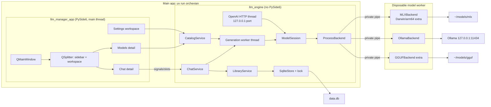
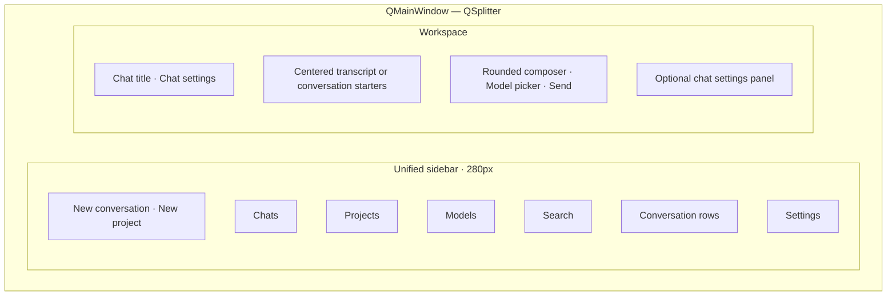

# Orchevian: Greenfield Redesign

**Naming update (2026-09-11):** The product and distribution are now **Orchevian**. Launch the GUI with `uv run orchevian` and the CLI with `uv run orchevian-engine`. Earlier product-name decisions are superseded. The implementation packages and real repository paths below remain unchanged; legacy launch commands, data directories, and environment variables remain supported. New installs use `~/.local/share/orchevian/`; existing installs reuse `~/.local/share/llm-manager/`. GUI preferences migrate once into Orchevian's settings namespace.

| Field | Value |
| --- | --- |
| **Status** | Draft roadmap; workspace UI updated 2026-09-07 |
| **Author** | Grok (for Seth Hardin) |
| **Date** | 2026-09-02 |
| **Revision** | 6 — Seth reversed SwiftUI: one Python codebase, new PySide6 GUI, in-process `llm_engine`, macOS + Windows + Linux |
| **Product** | Orchevian — local-first desktop app for running LLMs on this machine |
| **Workspace** | `/Users/sethhardin/llm-manager-ai` |
| **Legacy (read-only)** | `/Users/sethhardin/dev/llm-manager/llm-manager-ai` (themed Qt), `/Users/sethhardin/dev/llm-manager/llm-manager-human` (original Qt) |
| **Existing data** | `~/.local/share/llm-manager/data.db` — migrate, do not wipe |

This is a new product and a new codebase. It is not a restyle of `chat_page.py`. The legacy trees are a capability inventory and a list of mistakes.

**Workspace update (2026-09-07):** Seth approved a substantial visual and workflow redesign. The implemented UI now uses one combined navigation/conversation sidebar, a centered chat workspace, fully hideable chat settings, and a searchable model library with its own detail surface. K5, K7, Information Architecture, and the visual tokens below describe this revision. Earlier PR titles and roadmap examples remain historical planning context.

**Memory and privacy update (2026-09-11):** Settings is embedded in the workspace. Automatic memory extraction is enabled by default for completed regular responses, uses the existing evidence-checked note pipeline, and can be disabled in General. Private chats use ephemeral engine conversations with negative IDs, never write the library or vault, never recall saved context, and are erased when explicitly cleared or the app closes. Private Chat opens from the top toolbar and fills the workspace until cleared. Their prompts include only messages from the same current private chat.

**Human Interface Guidelines pass (2026-09-09):** Apple’s HIG guides the desktop interactions within the existing cross-platform PySide6 app. The View menu offers Show/Hide Sidebar and a keyboard shortcut, following [sidebar guidance](https://developer.apple.com/design/human-interface-guidelines/sidebars). Downloads open from the top-right toolbar in a transient panel, preserving the current workspace. Compact download rows expand to reveal repository and version details, following [popover](https://developer.apple.com/design/human-interface-guidelines/popovers) and [disclosure control](https://developer.apple.com/design/human-interface-guidelines/disclosure-controls) guidance. Model technical details and maintenance actions are also collapsed by default. Sidebar branding and duplicate creation controls move into a restrained toolbar; macOS uses Qt’s Mac style and unified title/toolbar support. Actual transfers show byte progress, queued work shows a waiting status, and cancellation shows activity until cleanup completes; completed work hides its progress indicator, following [progress guidance](https://developer.apple.com/design/human-interface-guidelines/progress-indicators). Download controls identify the repository and version to assistive technology. Permanent model deletion uses an explicit Delete Model action with Cancel as the default and Escape action, following [alert guidance](https://developer.apple.com/design/human-interface-guidelines/alerts). This pass does not establish native AppKit, Liquid Glass, or VoiceOver parity; those require platform-specific implementation and testing.

**Second Brain implementation (2026-09-07):** The sidebar also opens a Markdown vault with a reader/editor, wiki links, backlinks, search, and an interactive graph. `MemoryVault` owns file access, revision checks, and trash; the GUI does not access SQLite. `ChatService.capture_memories` shares the model session with chat and extracts at most six notes with exact conversation evidence, linked source snapshots, and model attribution. A cancellable Qt worker performs capture, and unchanged saved conversations are deduplicated. Optional keyword recall includes at most four non-source notes in chat context and is enabled by default. The vault defaults to `second-brain/` beside the database; vault selection and recall preferences live in `QSettings`. This adds Markdown files without changing the conversation database schema.

**Model recovery update (2026-09-07):** A stuck load must be stoppable without waiting for backend code to cooperate. Production backends now use a disposable spawned process for loading and inference, with private pipes and no database access in the child. Engine services and the GUI remain in the main app. Direct cancellation bypasses the occupied Qt worker; cancellation tokens also cover requests queued before loading starts. Load and first-response waits have 120-second deadlines. Models exposes Cancel loading, and a global Force stop model control remains accessible across workspaces. Ollama load now preloads the model, and unload requests `keep_alive: 0` with a five-second timeout. Failure to confirm external Ollama cleanup is reported explicitly. This supersedes the earlier single-process runtime restriction in K18.

---

## Overview

Orchevian is a personal, local-first desktop app for discovering, loading, and chatting with large language models on this machine. It is not a multi-user SaaS, not a cloud wrapper, and not a themed experiment.

The current app failed as a *product*, not as a missing stylesheet. Two Grok sessions tried to rescue a Claude-built PySide6 GUI by restyling it; both made the information architecture and the visual system worse. Chat, projects, settings, models, templates, and the API server were stuffed through a chat-centric shell (`ChatPage.attach_settings` in [`main_window.py`](/Users/sethhardin/dev/llm-manager/llm-manager-ai/src/llm_manager/gui/main_window.py)). Inference, SQLite, and uvicorn lifecycle leaked into widgets. `chat_page.py` is 1,337 lines and owns the sidebar, the conversation tree, the HTML-table transcript, the composer, and a settings stack.

This redesign is **one Python 3.13+ codebase**:

1. **`llm_engine`** — a library (no PySide6 import) that owns models, backends, SQLite, downloads, ChatService, and the optional OpenAI-compatible HTTP server.
2. **`llm_manager_app`** — a **new** PySide6 GUI that talks only to those services. It never opens sqlite3 itself, never imports `mlx_lm` / `llama_cpp`, and never starts uvicorn.

GUI and engine services share a process; model loading and inference run in a disposable child process. Qt main thread never calls `stream_generate` or `mlx_lm.load`. One generation worker thread relays results via queued signals.

GUI platforms: **macOS, Windows, Linux.** Backends: Ollama everywhere; GGUF optional extra; MLX optional extra on Darwin/arm64 only.

v1 ships: model list + select, new chat, streaming reply, conversation list with rename/delete, project grouping, system prompt, generation presets, settings for model dir / API, and an in-place migration of `data.db`.

---

**Project workspace update (2026-09-12):** Project creation is an embedded QWidget in the center stack; selecting a project opens a home with a composer, conversation list, and inline guidance editor. No project dialog or separate window is used. Home drafts are owned per project for the app session. Settings supplies an app-wide model fallback, resolved after explicit and project choices without rewriting existing conversations. Saved unavailable references remain visible. Downloaded models expose an inline Edit model flow for display names only. File context, scheduling, connectors, and improved download transport remain future work.

## Key Decisions

| # | Decision | Rationale |
| --- | --- | --- |
| K1 | **Greenfield rebuild** in `/Users/sethhardin/llm-manager-ai`. Do not copy `chat_page.py`, `theme.py`, `native_glass.py`, or the QSS. | Two restyle sessions failed. The foundation is the problem. |
| K2 | **Option A: new PySide6 GUI + in-process `llm_engine`.** Not SwiftUI. Not a browser/Tauri/Electron shell. Not two GUIs. | Seth requires a GUI on Linux, Windows, and Mac (2026-09-02, reversing the Swift pick). MLX is a Mac-only *backend extra*, not a reason to lock the GUI. |
| K3 | **Python package is `llm_engine`**, product name is **Orchevian** for v1. GUI package is `llm_manager_app`. | Marks the break from `llm_manager`. Renamed to Orchevian on 2026-09-11. |
| K4 | **GUI ↔ engine is in-process Python** (typed service methods, not JSON-RPC). Optional OpenAI HTTP is a *separate* loopback listener the engine owns. | One language; inference is isolated in a disposable worker. `orchevian-engine serve` is only the OpenAI API, not a GUI control plane. |
| K5 | **Two-pane shell** (QSplitter): unified sidebar · workspace. Models owns an internal list/detail split. | Give conversations more space; keep projects, search, and recent chats together. |
| K6 | **Settings inside the main workspace** (⌘, / Ctrl+,). Per-chat system prompt and sampling live in a chat inspector, not in Settings. | The old app hid Models/Storage/Templates/Server/Appearance behind a “mode” menu on the chat rail. |
| K7 | **Visual system “Studio”**: system UI font, 12px controls, 26px composer, dedicated sidebar surface, palette-aware Qt line icons, and restrained blue accents. | Clear hierarchy, readable contrast in both themes, and a comfortable reading width. |
| K8 | **`list_conversations()` returns summaries, never messages.** Messages load per conversation. | Old `database.list_conversations()` joins every message of every chat. |
| K9 | **Explicit `load` / `unload` with a single loaded model cache.** `stream_generate` does not reload weights. | `MLXBackend.stream_chat` calls `mlx_lm.load()` on every send. `GGUFBackend` constructs a new `Llama()` on every send. |
| K10 | **Backend errors propagate.** Ollama-down is a visible status, not an empty list. | `backends.list_all_models()` swallows all exceptions. |
| K11 | **API `stop()` must stop uvicorn.** Engine holds a `uvicorn.Server` and sets `should_exit`. | `api_server.stop()` only flips `_server_running`. |
| K12 | **Migrate `data.db` in place.** Path is `Path.home() / ".local" / "share" / "llm-manager" / "data.db"` **on all OSes** for v1. | One conversation already lives there. Do not fork a Windows `%APPDATA%` path in v1. |
| K13 | **GUI is macOS + Windows + Linux.** App Sandbox off. Not MAS. | Seth’s requirement. MLX extra is Darwin/arm64 only; missing extra → unavailable, no crash. |
| K14 | **Ollama is the first-class backend.** | This machine’s library today is four Ollama tags and empty `~/models/{mlx,gguf}`. |
| K15 | **Engine PRs first. Do not start GUI PRs until ChatService (PR 5) exists.** Fallback if the GUI slips: `orchevian-engine chat` TTY. | Domain logic is independently testable. We do not “just throw a window up.” |
| K16 | **No dedicated Server page.** OpenAI **endpoint** in PR 6 + Settings → API tab in PR 12b. Templates stay **off the sidebar until PR 14** (not a v1 blocker). | Seth confirmed 2026-09-02. |
| K17 | **One `QMainWindow`.** PySide6 ≥ 6.7, Qt 6. No Swift `WindowGroup`. | One generation globally. |
| K18 | **Disposable model worker process.** Quit cancels model work and terminates its runtime; engine services and the database stay in the main app. | Native model loaders must be stoppable even when blocked or holding the GIL. |
| K19 | **Engine settings live in `config.json`** (`model_dir`, `api_port`). Host hardcoded `127.0.0.1`. GUI chrome (theme, inspector open, last conversation id, Return-to-send) in `QSettings`. | Model dir and API port are engine state. |
| K20 | **Service interfaces + pytest are the contract.** No Swift Codable, no JSON-RPC golden fixtures. | `backends/protocol.py` + ChatService / LibraryService / CatalogService signatures. |
| K21 | **Python is the only inference host.** No mlx-swift. No split backends across languages. | Ollama + HF + FastAPI + the GUI are all Python. |
| K22 | **GGUF `n_ctx` is a load option (default 8192), not `GenerationParams.max_tokens`.** Ollama cancel = close the HTTP body. | Old GGUF set `n_ctx=params.max_tokens` (often 2048). |
| K23 | **Return sends, Shift+Return newline.** Settings can flip to Ctrl/⌘+Return. | Seth confirmed 2026-09-02. |
| K24 | **App icon with later packaging, not v1 `uv run`.** | Seth confirmed 2026-09-02. |

---

## Background & Motivation

### What the app is supposed to do

Jobs to be done, carried forward:

1. Discover, download, and inspect local models (MLX, GGUF, Ollama).
2. Chat with a selected local model (streaming, system prompt, temperature / top_p).
3. Organize chats and projects (a project is a folder of chats that also seeds instructions + default model).
4. Prompt templates.
5. Optional local OpenAI-compatible HTTP API bound to 127.0.0.1 so other tools can talk to the loaded model.
6. Storage / disk usage for downloaded models.

Audience: a technical user (Seth) who already has models on disk — in practice via Ollama — and wants a calm desktop app, not a dashboard. The GUI must run on the machines he uses, not only a Mac.

### Current state (legacy, cited)

Two trees, same engine, different chrome:

| | Human tree | AI tree |
| --- | --- | --- |
| Path | `/Users/sethhardin/dev/llm-manager/llm-manager-human` | `/Users/sethhardin/dev/llm-manager/llm-manager-ai` |
| GUI | PySide6, sidebar groups in `MainWindow` | PySide6, everything stuffed into `ChatPage` |
| Theme | “Claude-Desktop-calm / dark academia” | “Lamp-glass over a reading room” + `pyqt-liquidglass` |
| Lines | slightly smaller GUI | **~4,925 Python lines; ~4,050 GUI / ~870 engine** (approximate) |

Engine (shared shape, ~870 lines, actually useful):

- [`config.py`](/Users/sethhardin/dev/llm-manager/llm-manager-ai/src/llm_manager/config.py) — `~/models`, `~/.local/share/llm-manager/data.db`, API `127.0.0.1:8080`
- [`models.py`](/Users/sethhardin/dev/llm-manager/llm-manager-ai/src/llm_manager/models.py) — `LocalModel`, `ChatMessage`, `Conversation`, `Project`, `PromptTemplate`
- [`database.py`](/Users/sethhardin/dev/llm-manager/llm-manager-ai/src/llm_manager/database.py) — sqlite3 module-level CRUD
- [`backends/`](/Users/sethhardin/dev/llm-manager/llm-manager-ai/src/llm_manager/backends) — MLX, Ollama, GGUF
- [`hub.py`](/Users/sethhardin/dev/llm-manager/llm-manager-ai/src/llm_manager/hub.py) — Hugging Face search/download
- [`api_server.py`](/Users/sethhardin/dev/llm-manager/llm-manager-ai/src/llm_manager/api_server.py) — FastAPI `/v1/models`, `/v1/chat/completions`

This machine, 2026-09-02:

- `data.db`: 1 conversation (`id=4`, title `"New Chat"`, model `deepseek-coder-v2:16b` / `ollama`), 0 messages, 0 projects, 0 templates, 0 favorites. `project_id` is a trailing ALTER column. `sqlite_sequence` is `conversations=8`, `messages=10`, `projects=3`.
- `~/models/mlx` and `~/models/gguf`: empty.
- Ollama at `127.0.0.1:11434`: `qwen2.5-coder:14b`, `deepseek-coder-v2:16b`, `qwen3.8:27b-mlx`, `qwen3:8b`.

### Why restyling failed

Session 1 (2026-09-01): “aesthetic is not good. The interface is not user friendly and I find it difficult to use.”

Session 2 (2026-09-02): polish, then Apple “liquid glass” via `pyqt-liquidglass` + `NSVisualEffectView`. Too rounded, not see-through, then disjointed. Theme copy drifted into walnut / brass / lamp-glass.

This session: complete redesign. Rev 5 picked SwiftUI; Seth reversed that because the GUI must run on any OS. **The engine correctness bar from rev 5 still stands.** We do not copy the old GUI.

### Concrete mistakes to not repeat

**Architecture**

- GUI owns inference (`InferenceThread` constructed by `ChatView._start_inference`).
- GUI owns the DB: `ChatView._conv()` is `next((c for c in db.list_conversations() if c.id == self.conv_id), None)`.
- GUI owns server lifecycle (`ServerPage._toggle_server`).
- Module-level singletons; unused `typer`; `main()` only launches Qt.

**Correctness**

- `list_conversations()` always `_load_messages` for every row.
- `_connect()` runs schema + migrate on every call; new connection per helper.
- `list_all_models()`: `except Exception: pass`.
- `api_server.stop()` only clears a boolean.
- MLX and GGUF reload the full model per prompt.
- `hub.pull_mlx` / `pull_gguf` accept progress callbacks and never fire them.
- Tests: `tests/test_smoke.py` is `assert True`.

**UI**

- Transcript is HTML tables inside `QTextEdit`. Streaming rebuilds the entire HTML document every 80ms.
- `paintEvent` punches a transparent hole for `NSVisualEffectView`.
- Appearance, models, storage, templates, and the API server are not first-class surfaces.

Rev 6 still forbids copying those widgets. The new GUI is a *new* PySide6 app behind a service boundary.

---

## Goals & Non-Goals

### Goals (v1 must-have)

- Desktop app on **macOS, Windows, and Linux**: sidebar + list + content, menu bar, Settings workspace.
- Engine/UI split: `llm_engine` does not import PySide6. GUI does not import sqlite3, `mlx_lm`, `llama_cpp`, fastapi, or huggingface_hub.
- Model catalog: list MLX (when extra present on Darwin/arm64), GGUF (when extra present), Ollama; select one; show availability errors.
- Chat: new conversation, streaming on a background thread, stop, regenerate, system prompt, Precise/Balanced/Creative, temperature / top_p / max_tokens.
- Conversations: list, search-by-title, rename, delete, persist.
- Projects: folder + instructions + default model; delete keeps chats (`ON DELETE SET NULL`).
- Settings: model directory and API port in `config.json`; appearance in `QSettings`.
- Migrate existing `data.db` without wiping Seth’s row or resetting `sqlite_sequence`.
- Tests of domain logic (conversations, migration, FakeBackend, ChatService, API start/stop), not `assert True`.
- UI never blocks on inference, load, or download.
- Launch: `uv run orchevian` (and `uv run orchevian-engine chat` as TTY fallback).

### Nice-to-have in v1 if cheap

- Prompt templates (hidden from sidebar until PR 14).
- Favorites / pinned models.
- Hugging Face search + download with real progress.
- OpenAI-compatible API with working start/stop + Settings → API tab (not a Server page).
- Storage summary.

### Non-goals (v1)

- Cloud accounts, sync, multi-user, auth.
- SwiftUI, WKWebView, Tauri, Electron, two GUIs.
- Copying `chat_page.py` / `theme.py` / `native_glass.py`.
- JSON-RPC Unix-socket control plane for the GUI.
- Mac App Store / sandboxed distribution.
- Plugin marketplace, tool-calling, agents, RAG, embeddings.
- Side-by-side model comparison.
- Mobile.
- Bundled runtime / PyInstaller as a v1 gate (v1.1).
- VoiceOver / reduced-motion as a v1 gate.
- Dual-writing `data.db` with the old Qt app. Quit the old app before live `uv run orchevian`.

---

## Tech Choice

### Option A — New PySide6 app, in-process `llm_engine` *(chosen)*

**What it is.** Python 3.13, uv, PySide6 ≥ 6.7 for a *new* GUI. Engine is a library in the same process. Backends stay Python.

**Pros**

- One language, one toolchain, one `uv run` on Mac, Windows, and Linux.
- Fastest reuse of MLX / Ollama / GGUF / FastAPI.
- Agents generate Python more reliably than Swift.
- Service layer can still be enforced: GUI imports `llm_engine.services`, never sqlite3.

**Cons**

- Qt will not feel like Notes. Mitigation: QListView / QPlainTextEdit / QTextBrowser, Studio tokens, modest QSS, **no HTML-table bubbles**, no `NSVisualEffectView`.
- Social (code review) rather than process isolation. Mitigation: `llm_engine` must not import PySide6; CI grep; pytest covers ChatService without Qt.

**Why A now.** Seth requires any-OS GUI. That is a product constraint, not inertia. The *old* PySide6 app is still the wrong foundation; we rebuild the GUI, we do not restyle it.

### Option B — SwiftUI Mac app + Python sidecar *(rejected)*

Best native Mac feel. Rejected: locks the GUI to macOS. Seth reversed this on 2026-09-02.

### Option C — Local web UI *(rejected)*

Conflicts with “desktop app.” FastAPI stays only as the OpenAI face of the engine.

### Recommendation

**A.** One Python codebase. New PySide6. In-process `llm_engine`. MLX is an optional extra on Apple Silicon, not the GUI platform.

---

## Proposed Design

### System architecture



Rules:

- `llm_engine` never imports PySide6.
- GUI never imports sqlite3, `mlx_lm`, `llama_cpp`, fastapi, huggingface_hub.
- Qt main thread never calls `stream_generate` or `ModelSession.load`.
- Only `SqliteStore` writes `data.db`. WAL, one connection, one lock.
- OpenAI server is optional; stopping it does not quit the GUI.

### Repository layout

```
/Users/sethhardin/llm-manager-ai/
  README.md
  DESIGN.md
  pyproject.toml
  src/llm_engine/                 # NO PySide6
    __init__.py
    __main__.py                   # orchevian-engine CLI
    cli.py                        # chat | models | serve | migrate | health
    config.py                     # config.json
    domain/{models.py, chat.py, errors.py}
    store/{schema.sql, sqlite.py, library.py, migrations/}
    backends/{protocol.py, registry.py, ollama.py, mlx.py, gguf.py, fake.py}
    services/{catalog.py, chat.py, session.py, hub.py, openai_api.py}
    logging.py
  src/llm_manager_app/            # PySide6 only; imports llm_engine.services
    __init__.py
    __main__.py                   # llm-manager GUI
    main_window.py
    tokens.py                     # Studio hex + small QSS
    widgets/{sidebar.py, conversation_list.py, chat_view.py, composer.py,
             transcript.py, model_picker.py, models_view.py, settings.py,
             inspector.py}
    workers.py                    # QThread adapter around ChatService
  tests/
    conftest.py
    test_library.py
    test_migrate.py
    test_session.py
    test_chat_service.py
    test_openai_api.py
    test_config.py
    test_engine_no_pyside.py      # fail if llm_engine imports PySide6
    fixtures/legacy_data.db
    fixtures/pre_project_id.db
```

Legacy trees stay read-only until parity; then archive.

Dev launch:

```bash
uv run orchevian          # GUI
uv run orchevian-engine chat      # TTY fallback
uv run orchevian-engine serve     # OpenAI HTTP only
uv run orchevian-engine models
uv run orchevian-engine migrate
uv run orchevian-engine health    # print session + db + api status (in-process)
```

### Engine: domain types

These replace [`models.py`](/Users/sethhardin/dev/llm-manager/llm-manager-ai/src/llm_manager/models.py). They are the in-process types the GUI imports. Datetimes are naive ISO-8601 matching the live DB (`2026-08-28T11:39:57.313141`). Enums are lowercase (`"ollama"`). Presets are `"precise"|"balanced"|"creative"`; the UI title-cases them (old `chat_page.py:52-56` tuples, same numbers).

```python
# src/llm_engine/domain/models.py
from __future__ import annotations

from dataclasses import dataclass, field
from datetime import datetime
from enum import StrEnum
from pathlib import Path
from typing import Iterator, Protocol


class BackendName(StrEnum):
    MLX = "mlx"
    OLLAMA = "ollama"
    GGUF = "gguf"


@dataclass(frozen=True, slots=True)
class ModelRef:
    backend: BackendName
    name: str

    @property
    def id(self) -> str:
        return f"{self.backend}/{self.name}"


@dataclass(frozen=True, slots=True)
class LocalModel:
    ref: ModelRef
    path: Path | None
    size_bytes: int
    modified_at: datetime | None = None
    details: dict[str, str] = field(default_factory=dict)
    available: bool = True
    unavailable_reason: str | None = None


@dataclass(frozen=True, slots=True)
class LoadOptions:
    """GGUF context window. Default 8192. Not per-send max_tokens."""
    n_ctx: int = 8192


@dataclass(frozen=True, slots=True)
class GenerationParams:
    temperature: float = 0.7
    top_p: float = 0.9
    max_tokens: int = 2048

    @classmethod
    def preset(cls, name: str) -> GenerationParams:
        key = name.strip().lower()
        return {
            "precise": cls(0.2, 0.8, 2048),
            "balanced": cls(0.7, 0.9, 2048),
            "creative": cls(1.1, 0.98, 2048),
        }[key]


@dataclass(frozen=True, slots=True)
class ChatTurn:
    role: str  # "user" | "assistant" | "system"
    content: str
    tokens_per_sec: float | None = None  # stores chunks/s
    elapsed_s: float | None = None
    created_at: datetime | None = None


@dataclass(frozen=True, slots=True)
class ConversationSummary:
    id: int
    title: str
    model: ModelRef | None
    project_id: int | None
    message_count: int
    updated_at: datetime
    created_at: datetime


@dataclass(frozen=True, slots=True)
class Conversation:
    summary: ConversationSummary
    system_prompt: str
    messages: tuple[ChatTurn, ...]


@dataclass(frozen=True, slots=True)
class Project:
    id: int
    name: str
    instructions: str
    default_model: ModelRef | None
    created_at: datetime


class EngineError(Exception):
    code: str  # generating | no_model | not_found | load_failed | backend_unavailable | cancelled | config_invalid | bind_failed


class CancelToken(Protocol):
    def is_set(self) -> bool: ...


class LoadedHandle(Protocol):
    model: LocalModel


class InferenceBackend(Protocol):
    name: BackendName

    def is_available(self) -> tuple[bool, str | None]:
        """(ok, reason). Never raise for 'not installed' / 'daemon down'."""

    def list_models(self) -> list[LocalModel]:
        """Raise EngineError on unexpected failure. Empty list is valid."""

    def load(self, model: LocalModel, options: LoadOptions | None = None) -> LoadedHandle: ...
    def unload(self, handle: LoadedHandle) -> None: ...

    def stream_generate(
        self,
        handle: LoadedHandle,
        messages: list[ChatTurn],
        params: GenerationParams,
        cancel: CancelToken,
    ) -> Iterator[str]:
        """Yield text deltas. Honor cancel between tokens."""

    def delete(self, model: LocalModel) -> None: ...
```

MLX `is_available`: if not Darwin/arm64 or `mlx_lm` missing → `(False, "MLX requires macOS Apple Silicon and extra 'mlx'")`. Import `mlx_lm` only inside `load` / `stream_generate`. Same pattern for `llama_cpp`.

Ollama client talks to `http://127.0.0.1:11434`, not `localhost`. Down daemon → reason string on the Models banner, not an empty silent list.

### Engine: session cache

```python
class ModelSession:
    def status(self) -> SessionStatus: ...  # loaded, generating, conversation_id
    def load(self, ref: ModelRef, options: LoadOptions | None = None, on_progress=None) -> LocalModel: ...
    def unload(self) -> None: ...
    def generate(self, messages: list[ChatTurn], params: GenerationParams, cancel: threading.Event) -> Iterator[str]: ...
```

- `load` is a no-op if `ref` is already loaded with the same `n_ctx`.
- Loading a different ref (or `n_ctx`) unloads first.
- **`n_ctx` default 8192** on GGUF `Llama(...)`. MLX ignores (uses `config.json`). Ollama: stored and sent as `options.num_ctx`.
- Ollama `load` is otherwise a no-op; `stream_generate` is HTTP. **Cancel = `response.close()`.**
- `generate` without a loaded model raises `EngineError("no_model")`.
- Idle `catalog.load` / `unload` run on the **generation worker**, same lock as send. A 27B MLX load must not freeze the Qt event loop.
- `load` / `unload` / second `send` while the lock is held → `EngineError("generating")`. Not queued.
- Optional extras imported inside load, never at engine import.

### Engine: library / SQLite

- One `SqliteStore` per process, one `sqlite3.Connection`.
- `sqlite3.connect(path, isolation_level=None, check_same_thread=False)`.
- One `threading.Lock` around **every** SQL statement (generation worker + OpenAI thread).
- `PRAGMA foreign_keys=ON`, `journal_mode=WAL`, `busy_timeout=5000`.
- Schema via `schema_migrations`, not `CREATE TABLE IF NOT EXISTS` on every call.
- Test: `list_conversations` during blocked `FakeBackend.generate` does not raise.

**Transactions**

| Operation | Transaction |
| --- | --- |
| `send` persist user row + retitle | **one** txn, committed before the worker starts generating |
| persist assistant row + `updated_at` + metrics | **a second** txn after the token loop (or cancel-with-text, or error-with-text) |
| `stop` before first token | no assistant txn |
| project / conversation create | one txn each |

**Migration 001** (never DROP, never recreate — live `sqlite_sequence` conversations=8):

```
CREATE TABLE IF NOT EXISTS schema_migrations (
    version INTEGER PRIMARY KEY,
    applied_at TEXT NOT NULL
);
if schema_migrations contains 1: return
if table conversations is missing:
    execute schema.sql   -- five tables INCLUDING project_id
else:
    if conversations has no project_id:
        ALTER TABLE conversations ADD COLUMN project_id INTEGER
            REFERENCES projects(id) ON DELETE SET NULL
insert schema_migrations(1, now)
```

**002:** indexes on `messages(conversation_id, id)`, `conversations(updated_at DESC)`, `conversations(project_id, updated_at DESC)`.

Boot: if `schema_migrations` missing (sqlite_master), copy `data.db` → `data.db.bak-pre-engine`, then apply 001/002. Tests use a copy of the live file **including `sqlite_sequence`** (id=4 survives, next INSERT is 9) plus a pre-`project_id` fixture.

Do not run the old Qt app and the new app against the live DB at the same time.

Path on **all OSes**: `Path.home() / ".local" / "share" / "llm-manager" / "data.db"`.

Required queries: list without message bodies; messages for one `conversation_id` only.

`LibraryService` v1: `list_conversations`, `get_conversation`, `create_conversation`, `rename`, `delete`, `move_to_project`, `list_projects`, `create/update/delete_project`. Templates/favorites stay in the store; GUI façade waits for PR 14.

Project seed: `create_conversation(project_id=P)` copies `instructions → system_prompt` and default model. Delete project SET NULLs `project_id`.

`ChatTurn.created_at` is optional/NULL on old rows.

### Engine: config.json

Path: same directory as `data.db`. Created on first `config.set` or first GUI/CLI start with defaults.

```json
{
  "model_dir": "/Users/sethhardin/models",
  "api_port": 8080
}
```

No `api_host`. Host is `127.0.0.1` (not `localhost`, not `::1`). `model_dir` expanded (`~`), `mlx/` and `gguf/` created if missing. Invalid port → `EngineError("config_invalid")`. File mode `0600` where the OS supports it. Atomic replace.

GUI Settings Models/API write `config.get` / `config.set` on the engine, not `QSettings`.

### Threading (Qt + worker)

```
┌─────────────────────────────────────────────┐
│ Qt main thread                              │
│  widgets, QSettings, queued slots           │
│  never stream_generate / mlx_lm.load        │
└──────────┬────────────────────▲─────────────┘
           │ enqueue job        │ Signal(token/done/error/progress)
           ▼                    │
┌───────────────────────────────┴─────────────┐
│ Generation worker (one at a time)           │
│  ChatService.send / regenerate              │
│  CatalogService.load / unload               │
└──────────┬──────────────────────────────────┘
           │ store.lock
           ▼
      SqliteStore     ModelSession
```

1. **One generation lock.** Extra `send` / `load` / `unload` while held → `EngineError("generating")`. GUI disables Send and shows a banner.
2. **`send` on the GUI thread:** validate, take lock (or show busy), persist user+retitle under `store.lock`, enqueue worker, return immediately. Worker load/generate/notify via Qt signals (`QueuedConnection`).
3. **Idle `catalog.load` / `unload`:** same worker and lock. GUI keeps pumping events. `chat.stop` during load sets the Event (best-effort; if load is uninterruptible, unload after return and emit `load_failed` with cancelled).
4. **`stop`:** set `threading.Event` on the GUI thread; do not wait. If idle, no-op.
5. **Coalesce:** flush `token` signals at most every **40 ms** or **32 chunks**, **and before any terminal** (`done` or `error`). Order: flush remaining buffer → persist (if any) → emit terminal.
6. **Terminals:** exactly one of `done` or `error`, never both.
7. OpenAI HTTP thread shares `ModelSession` + `store.lock`. Busy → HTTP 429.

Adapter: `llm_manager_app/workers.py` wraps ChatService in a `QObject` moved to a `QThread`, or a `threading.Thread` that emits via `QMetaObject.invokeMethod`. Either is fine; pytest tests ChatService without Qt.

### ChatService

**Assemble prompt** (old `ChatView._build_messages`):

```
turns = []
if conversation.system_prompt.strip():
    turns.append(ChatTurn(role="system", content=system_prompt.strip()))
for m in stored_messages:  # user + assistant only
    turns.append(m)
# system prompt is NOT a messages row
```

**`send`**

1. Reject if generating (`generating`).
2. Reject empty content.
3. Reject missing model (`no_model`).
4. Txn 1: insert user row; if `title in DEFAULT_TITLES` set `title_from(content)`.
5. Return control to GUI (accepted).
6. Worker: auto-load if needed (progress callbacks) → `stream_generate` → coalesce.
7. Success: flush buffer, txn 2 assistant row, emit `done {cancelled: false, chunks, elapsed, tps}`.
8. **Exception after accepted:**
   - ≥1 chunk: flush remaining `token`s, persist partial, emit **only** `error` (`load_failed` if auto-load threw, else `backend_unavailable`).
   - 0 chunks: no assistant row, only `error`.
   - GUI keeps the in-memory buffer (matches the row because of the flush), shows a banner, does not expect `done`.

**Titles**

```python
DEFAULT_TITLES = frozenset({"New Chat", "New chat", ""})

def title_from(text: str) -> str:
    line = text.strip().splitlines()[0].strip() if text.strip() else ""
    if len(line) > 42:
        line = line[:42].rstrip() + "…"
    return line or "New Chat"
```

Retitle **only** when title ∈ `DEFAULT_TITLES` (live row is `"New Chat"`).

**`regenerate`:** params from this call (default Balanced). If last message is assistant, delete it then re-run; if last is user, re-run; if empty, `not_found`. Same lock.

**`stop`:** set the operation's cancellation Event directly. After ≥1 chunk: persist partial, `done {cancelled: true, chunks, elapsed, tps}`. Before first chunk: no assistant row, `done {cancelled: true, chunks: 0}`. The runtime's owner polls every 50 ms, terminates its child process, and escalates to kill if termination does not finish within 500 ms. Ollama cleanup additionally requests model unload from its external service. The global Force stop model button and shortcut bypass the occupied Qt worker. Loads and first-response waits time out after 120 seconds.

**`set_model` / `set_system_prompt`:** write through; allowed during generate (next turn).

**`chunks`:** backend yield count, not tokenizer tokens. Inspector label “chunks/s”. SQLite column remains `tokens_per_sec` (stores chunks/s).

PR 5 tests: system prompt not stored as a message; project seed; retitle only on default titles; stop-before-token; regenerate edges; yield-once-then-raise; raise-before-yield; 31 unflushed chunks then raise (tokens flushed before error); list-during-generate.

### OpenAI-compatible API

- FastAPI `/v1/models`, `/v1/chat/completions` (stream + non-stream).
- Bind **`127.0.0.1` only**. No host argument. Port from `config.json` / `server.start(port=)`.
- `uvicorn.Server`; `stop()` sets `should_exit` and joins.
- Auto-load `req.model` if idle; if generating, 429.
- Last 50 requests in memory.
- `usage` omitted or zero; never `-1`.

### Hugging Face (nice-to-have)

Progress callback actually plugged into `snapshot_download` / `hf_hub_download`. Worker thread; GUI progress via signals. Ollama pull stays `POST /api/pull`.

### CLI

```
orchevian-engine serve [--db PATH] [--port N]   # OpenAI HTTP only
orchevian-engine health
orchevian-engine models
orchevian-engine chat [--model ollama/qwen3:8b]
orchevian-engine migrate [--db PATH]
```

`chat` is in-process ChatService (TTY). If the GUI is already running against the same DB, sqlite WAL + busy_timeout apply; prefer not to dual-write generate. `health` prints loaded model, schema version, api running.

---

## Information Architecture

One `QMainWindow` with native window controls. Title = conversation title or “Orchevian”. The sidebar spans the full content height, with a plus button on its Projects heading; the downloads toolbar belongs to the right workspace. The standard native titlebar and resizable frame remain intact on all platforms; expanded client-area and transparent-titlebar hints are not used. Private Chat hides sidebar and toolbar until explicitly cleared, while the native window controls remain available.



**Qt widgets (do not invent HTML tables):**

| Surface | Widget |
| --- | --- |
| Sidebar | `QListView` or `QTreeView` (projects as nodes). Not a custom-painted rail-as-everything. |
| Conversation list | `QListView` + model of `ConversationSummary` |
| Transcript | `QTextBrowser` with markdown rendered live while streaming (throttled, streaming turn replaced in place) plus caret; `QPlainTextEdit` keeps a partial response after an error or stop |
| Composer | `QPlainTextEdit`, 40–140px, wrap |
| Model picker | `QToolButton` + `QMenu` grouped by backend |
| Settings | separate `QDialog` / `QMainWindow` |
| Inspector | trailing `QWidget` in the chat splitter; hidden by default, existing preference preserved |

Selecting Models opens a full library workspace: search and backend-grouped rows on the left; model status, size, backend, metadata, and actions on the right. Clicking a sidebar conversation returns to chat. Find focuses the current workspace's search; in chat it also expands a collapsed sidebar.

**Shortcuts:** ⌘ on macOS, Ctrl on Windows/Linux.

| Key | Action |
| --- | --- |
| Ctrl/⌘N | New chat |
| Ctrl/⌘⇧N | New project |
| Ctrl/⌘, | Settings |
| Ctrl/⌘1 | Chats |
| Ctrl/⌘2 | Models |
| Ctrl/⌘3 | Second Brain |
| Ctrl/⌘L | Focus composer |
| Ctrl/⌘F | Focus list search |
| Return | Send (Shift+Return = newline); Settings can flip to Ctrl/⌘+Return |
| Escape | Stop loading, generation, or memory capture |
| Ctrl/⌘Shift+. | Force stop model |
| Ctrl/⌘⌫ or Del | Delete conversation |

**New chat:** Ctrl/⌘N. If a project is selected, seed instructions + default model. No scavenger hunt for an empty “New Chat”. Title stays `"New Chat"` until first send.

**Settings workspace:** General (appearance, Return-to-send), Models (`config.get/set`, rescan, reveal in file manager), API (PR 12b), Advanced (db path read-only, Open engine log). Opened through the sidebar or keyboard shortcut; Back to chats returns to the chat area.

**Empty states:** no models → “Open Models” + Ollama-down reason; project with no chats → “New Chat in {project}”.

---

## Visual System — “Studio”

Implemented as `llm_manager_app/tokens.py` plus a **small** QSS string (object names, not a 742-line theme). No `pyqt-liquidglass`. No `NSVisualEffectView`.

**Rejected:** lamp-glass / walnut / brass / serif wordmarks; capsules; generic AI dashboard; hole-punch compositing.

**Dark**

| Token | Hex | Use |
| --- | --- | --- |
| `canvas` | `#1B1D22` | Main workspace |
| `sidebar` | `#15171B` | Navigation and conversations |
| `elevated` | `#25282F` | Composer, inspector, code blocks |
| `text` | `#EDEEF2` | Primary |
| `secondary` | `#9A9FAA` | Meta |
| `accent` | `#8CA9FF` | Send, caret, links |
| `danger` | `#FF453A` | Destructive |
| `selection` | `#8CA9FF` @ 13% | Selected row |
| `separator` | `#FFFFFF` @ 9% | Hairlines |

**Light:** canvas `#FAFAF8`, sidebar `#EFF0ED`, elevated `#FFFFFF`, text `#252830`, secondary `#666B76`, accent `#4467C4`, danger `#FF3B30`, selection accent @ 9%, separator `#000000` @ 8%.

Type: system UI font (`.AppleSystemUIFont` / Segoe UI / system); SF Mono / Consolas / ui-monospace for metrics. **No serif.** No slogans.

Layout: default 1280×800, min 1024×680. Reading container capped at 820px with adaptive outer space. Radii 12px controls, 26px composer; send button 34px. Primary and secondary text have at least 4.5:1 contrast against the main surfaces in both themes.

**Motion and feel (September 22, 2026):** Apple-style restraint. Frequent and keyboard-driven actions (sidebar toggle, inspector, section switches, shortcuts) stay instant. `llm_manager_app/motion.py` holds the shared ease-out curve (`cubic-bezier(0.23, 1, 0.32, 1)`), 160 ms enter / 110 ms exit durations, and a `fade()` helper that starts from the current opacity. Only occasional, spatial moments animate: the downloads popover fades in (closing stays instant) and the activity pill appears after 300 ms of work so near-instant operations never flash it, then fades; a stop request shows it at once. Reduced motion reads the OS setting (macOS `NSWorkspace.accessibilityDisplayShouldReduceMotion`, Windows client-area animation) and makes every fade instant; the spinner becomes a steady dot. The spinner's angle comes from elapsed time at display rate. Every pressable control darkens on press; hover is quieter than selection; checkboxes are rounded and accent-filled; status notices are neutral and errors use a soft danger tint. Routine attachment explanations live in tooltips.

**Streaming caret:** 2×14px accent rect at the end of the assistant buffer; pulse unless the OS reduce-motion hint is set. During the turn, markdown renders live via the `markdown` package into `QTextBrowser` (fenced code on `elevated`): tokens are batched for 80 ms and only the streaming turn is replaced in place, so a redraw costs ~2 ms regardless of chat length (rebuilding all history took ~60 ms at 60 turns). Do not rebuild the whole history per tick. Do not use nested `<table>` bubbles.

---

## API / Interface Changes

No compatibility with old PySide6 widgets. Compatibility with `data.db` and OpenAI-shaped HTTP.

| Method | Path | Behavior |
| --- | --- | --- |
| GET | `/v1/models` | Catalog. `id` is `backend/name`. |
| POST | `/v1/chat/completions` | Chat. Stream supported. |

CLI: `orchevian` (GUI), `orchevian-engine` (library commands). Old script `llm-manager = llm_manager:main` launched Qt from the god-object tree — replaced.

---

## Data Model Changes

Keep existing tables byte-compatible. Add `schema_migrations` + indexes (see Engine: library). No new columns for v1.

Path: `~/.local/share/llm-manager/data.db` on every OS.

Not in SQLite: window frame, theme, last conversation, Return-to-send (`QSettings`). Model dir and API port: `config.json`.

---

## Alternatives Considered

1. **SwiftUI + sidecar** — rejected; GUI must be any-OS.
2. **Web UI** — rejected as the desktop GUI.
3. **HTTP control plane for the GUI** — unnecessary in-process; OpenAI HTTP stays optional and named “API.”
4. **Keep comparison mode** — out of v1.
5. **Rename the product** — renamed to Orchevian on 2026-09-11.
6. **Move data to Application Support / %APPDATA%** — deferred; XDG-style path on all OSes in v1.
7. **mlx-swift** — rejected; Python-only inference.
8. **Restyle the old `chat_page.py`** — rejected; that is how we got here.

---

## Security & Privacy

| Threat | Severity | Mitigation |
| --- | --- | --- |
| OpenAI API on LAN | High | Bind `127.0.0.1` only. No host setting. |
| Prompt content on disk | Medium (expected) | Local SQLite. Logs never write bodies, including DEBUG. |
| Model delete | Medium | Confirm; path-prefix check under `model_dir`; Ollama `/api/delete`. |
| Command injection | Low | Model names are data; argv spawn only if we ever shell out. |

No analytics. No accounts. Network: Ollama `127.0.0.1:11434`, Hugging Face when the user pulls, optional loopback API.

---

## Observability

- Engine/GUI: stderr + rotating `…/llm-manager/logs/app.log` (1 MB × 3), created on first launch.
- INFO: load/unload/send/stop/api-start. ERROR: backend failures, not swallowed.
- `--verbose` → DEBUG, still no prompt bodies.
- Inspector: chunks/s, elapsed, chunk count.
- `orchevian-engine health` dumps loaded model, schema version, api status.
- Failures are banners, not crash dialogs for Ollama-down / port-in-use.

---

## Process / thread lifecycle

| Event | Behavior |
| --- | --- |
| Launch | `uv run orchevian` → QApplication → construct services (SqliteStore, backends, ChatService) on the main thread, start worker thread idle. |
| Quit | `stop()` generation Event; join worker (timeout 3 s); `api.stop()` `should_exit`; close sqlite; `QApplication.quit`. |
| Crash in worker | Qt slot `error`; persist path already specified; worker restarted idle; do not auto-resend. |
| OpenAI thread | Started/stopped from Settings; independent of GUI lifetime except Quit. |

No pid file, no Unix socket, no `flock`, no Finder spawn, no `scripts/dev.sh` socket server.

---

## Current implementation sequence (updated September 22, 2026)

- Implemented in the working tree: PR 6 local text API, PR 12b Settings API controls, terminal chat/resume, and standalone migration. API tests cover shared-session contention, disconnect cancellation, streaming failures, and real listener stop/restart. The standalone server uses an in-memory library and a separate model session. CLI health reports configuration and explicitly does not inspect the running GUI.
- Implemented in the working tree: PR 14 prompt templates (sidebar editor, search, reuse in new chat, unsaved-edit protection) and PR 13 storage summary (Models disclosure, per-backend catalog sizes, free space, reveal folder). Regular chat drafts now stay separate per conversation during the app session.
- Initial v1.1 distribution slice in the working tree: PyInstaller desktop bundles with Python/Qt, explicit resource collection, early multiprocessing diversion, a frozen-app smoke check (temporary database, spawned fake inference, local API, and Qt rendering), platform archives/checksums, and a three-OS artifact workflow. Ollama remains separately installed; MLX/GGUF runtimes are excluded. See `packaging/README.md` for build commands and verification limits.
- Priority change requested September 15: implement document uploads/reading, persistent project documents, picture/scanned-document understanding, document creation, and optional chat web search before release signing and notarization. The ordered feature milestones below supersede the previous distribution-first sequence.
- Distribution follows the document milestones: native inference runtime bundles by platform, release signing/notarization, installers, and clean-machine validation. Continue updating the preview build and smoke checks as features introduce dependencies. Preview packaging does not establish a released or signed application.
- Validation on September 15: all 401 tests passed (loopback tests required execution outside the sandbox), Ruff passed, and the source smoke check passed in the isolated packaging environment. After accepting the Xcode license, the macOS arm64 bundle built successfully and passed all five frozen smoke checks; its archive and SHA-256 sidecar were generated in `dist/`. The three-OS workflow, clean-machine launches, and real-model inference in the packaged app remain unverified.
- September 22 preview refresh: rebuilt the macOS arm64 bundle with the artifact-revision fixes and passed all ten current frozen smoke checks. The checksum-verified archive also passed after extraction outside the checkout into a temporary path containing spaces with Python environment overrides removed. Reports: `dist/smoke-report.json` and `dist/archive-smoke-report.json`. This used fake inference and temporary data on the development Mac. Clean-machine/other-platform launches, packaged real-model inference, and native Office layout/recalculation remain unverified; Word access was not retried.
- September 22 broader model acceptance: `scripts/check_model_matrix.py` passed all nine cases (spreadsheet and slide creation/revision, source-grounded writing, four synthetic web-evidence cases including prompt injection, and two live searches) with the installed Qwen 3.5 4B MLX model in `dist/model-matrix-08/`. Fixes: arithmetic formula validation and circular-reference repair, exact-subject search queries, no retrieval timestamps in the model prompt, and a shared 8-second connection budget across a host's addresses with timed-out hosts skipped. After those fixes, 651 tests passed and the rebuilt preview and extracted archive passed all ten smoke checks. Bounded cases only; native Office layout/recalculation and clean-machine checks remain open.
- September 22 regression validation: all 601 tests passed with loopback access; Ruff and `git diff --check` passed. The initial sandboxed run failed ten loopback-dependent tests, all resolved by the complete rerun outside the sandbox. Existing Qt signal-disconnect and Starlette deprecation warnings remain.

The numbered rollout below remains historical context; use this status and `PROJECT_CONTEXT.md` to distinguish implemented work from planned features.

## Next feature milestones — documents and project workspace

User-approved priorities, September 15, 2026. Milestones 1–3 are implemented in
the working tree (milestone 3 uses Ollama for vision and separately installed Tesseract
for English OCR). Milestones 4 and 5 have initial implementations as described below;
bounded real-model creation/revision and sourced-answer fixtures have passed.
Broader model quality, native Office layout/recalculation, and milestone 6
remain outstanding. Complete them before release
signing/notarization. Extend the existing
Projects home and chat workspace; preserve the local-first Python/Qt architecture.

### 1. Chat uploads and document reading

Working-tree status: composer uploads/drop, cancellable isolated readers, original
storage in SQLite, draft removal, previews/export, bounded source context grouped
by question, and private-chat cleanup are implemented. Supported inputs are PDF,
DOCX, XLSX, CSV/TSV, UTF-8 text, and Markdown. Limits: 20 MB/file, 20 files/chat,
200,000 extracted characters/file, 8,000 source-data characters/reply. Source
history retains each saved question's latest generation; regeneration replaces
that question's excerpts along with its answer. Private source previews cover the
latest reply only. Real-model answer quality and clean-machine packaged document
reading still need manual acceptance checks.

Provide an attachment button and drag-and-drop in the composer. Users can attach
one or more files, see their names and processing state, remove an attachment
before sending, and reopen saved attachments after restarting the app.

Start with PDF, Word (`.docx`), Excel (`.xlsx`), CSV, plain text, and Markdown.
Extract readable text and table data while preserving useful source locations:
PDF pages, document headings, and spreadsheet sheet names/cell ranges. Report
unsupported, encrypted, corrupt, or unreadable files clearly. Image-only pages
must be identified as needing the visual-reading milestone, never treated as an
empty successful import. Expand to PowerPoint (`.pptx`) and additional formats
after the shared import path works.

Build one engine-owned file/import service for both chat attachments and project
files: managed local copies, file metadata, extraction status, bounded background
processing, cancellation, and persistent references through additive migrations.
The GUI calls services and does not run document parsers on its main thread.
Use relevant extracted passages within the model's context budget; show which
files/passages were supplied and preserve that provenance for each response.
Treat document contents as reference material, not instructions authorizing actions.

Acceptance: upload a PDF, DOCX, and XLSX, ask questions whose answers require their
contents, follow the displayed page/sheet references, restart and reopen the files,
and cancel or recover from a failed import without losing the chat. Verify that
large documents produce a visible context limit rather than silent whole-file
claims. Regular attachments persist; private-chat attachments are temporary and
are cleared with the private conversation, without entering the library or vault.

### 2. Project documents available across conversations

Working-tree status: project home has Files with upload, progress/cancel, preview,
save original, replace, and confirmed removal. It reuses the chat document readers
and limits, with up to 20 files per project. The current project's files are
available to new and existing chats on future turns. Each chat's **Project files**
button selects files for retrieval; selections persist, and newly uploaded files
start enabled. Chat attachments and selected project files share the 8,000-character
source-data budget. Retrieval is keyword-based, with versioned source excerpts
saved for each question's latest response.

Retention: replacement publishes a new version only after successful extraction;
failed or cancelled replacements leave the current version usable. Replacement
and removal delete the old original/extraction while retaining excerpts already
supplied to replies. Moving a chat changes future project-file retrieval, keeps its
own attachments and source history, and leaves each project's files with its
project. Prior answers still remain in conversation history. Deleting a project
removes its shared files, keeps its chats as unassigned, and preserves their own
attachments and saved source excerpts. Deleting a chat never deletes shared files.
Private Chat and the stateless API exclude project files. Real-model answer quality
and clean-machine packaged reading remain manual acceptance checks.

Add a **Files** area to the existing project home with upload, file list, processing
status, preview/open, replace, and remove actions. Users upload a document once;
new and existing conversations in that project can reference it on subsequent
turns. Project files and their index persist across app restarts.

Retrieve relevant passages from the current project's files on each response,
alongside attachments explicitly supplied to that chat. Let users select specific
files and inspect the sources used. Do not insert every entire document into every
prompt. Updating or removing a project file changes future retrieval; prior
responses retain a record of the source version they used. Define file retention
when deleting a project or moving a conversation so shared files are not accidentally
deleted and unrelated project documents do not appear in future context.

Acceptance: upload a brief and spreadsheet to one project, reference both from
two separate conversations, restart and continue, replace/remove a file and verify
future context changes. A different project, an unassigned chat, Private Chat,
and the stateless local API must not automatically receive those project files.

### 3. Pictures and scanned documents

Working-tree update, September 16: PNG/JPEG/WebP import, normalized image previews,
selected PDF-page rendering, and local English OCR through Tesseract's C API run
inside cancellable parser processes. The runtime is installed separately and missing
OCR has explicit setup guidance. PDF import selects up to eight visual/OCR pages;
ordinary text extraction remains capped at 200 pages. Inputs are capped at 20 MB
and 25 megapixels, previews at a 2,048-pixel edge and 2 MB, and replies at four images.
A per-chat Use images switch distinguishes vision from extracted-text-only context.
Ollama capabilities come from /api/show and are checked before image generation;
MLX/GGUF reject image input and can use OCR text. Rendered images persist with chat
or project originals through migration 005; private images stay in memory. Source
records include image/page labels, image hashes, and project versions. Replacement
and deletion discard old rendered bytes while retaining prior source metadata.

Validation covers real local OCR, isolated parser cancellation, image bounds, project
scoping/version retention, text-only rejection, and image-bearing turns crossing the
spawned model boundary. Real Ollama visual answer quality, additional OCR languages,
MLX/GGUF vision, and clean-machine platform acceptance remain unverified/deferred.


Support picture attachments (initially PNG, JPEG, and WebP), scanned PDF pages,
and visual content such as diagrams and charts. Add explicit backend/model
capability reporting and image-bearing chat inputs; offer a compatible local
vision model when the current model cannot interpret images. Start the backend
integration with Ollama, then add supported MLX/GGUF combinations as their runtime
support is implemented and verified.

Provide a local OCR path for extracting text from scanned documents. Keep OCR
text extraction distinct from interpreting visual layout, charts, and pictures.
Show processing progress and page limits, and allow page selection for long PDFs.
Reuse the attachment/project file store and preserve page/image provenance.

Acceptance: read a photographed page, answer a question about a chart using a
vision-capable model, and reference an indexed scanned PDF from another chat in
the same project. A text-only model must clearly report its visual limitation;
it must not silently discard images or claim to have seen them. Verify cancellation,
image-size limits, and private-chat cleanup through the actual worker processes.

### 4. General document and artifact creator

Working-tree update, September 17: an explicit **Create files** composer choice
drives a bounded `create_documents` JSON tool flow (one correction attempt) over
the existing model session. Strict declarative specifications feed isolated native
generators for DOCX/PDF/RTF/TXT/Markdown, XLSX/CSV/TSV, PPTX, HTML,
JSON/YAML/XML, and SVG/PNG. PDF forms have functional text and checkbox fields;
slides have editable titles/bullets and speaker notes; sheets have formats,
restricted formulas and bar/line charts; diagrams are ordered process steps.
Content/format capabilities are explicit rather than implying arbitrary layouts.

Migration 006 stores versioned specifications, files, previews and source snapshots.
Generated-file cards support preview, explicit save/open, latest-batch ZIP, revision,
project copies with retained reference text, and reusable specification templates.
Project-home creation choice transfers to its new chat. Creation uses selected
attachment/project context and preserves earlier versions; failed batches publish
nothing. Private results stay in memory and cannot enter templates/projects.
The API and memory capture do not invoke these tools. See README for limits.

Validation includes every advertised format, native structure read-back, rendered
PNG previews, form field types, slide notes, formula/chart retention, malformed
tool data, bounded repair, isolated cancellation, version retention/restart,
project retrieval and the Qt chat flow. PDF/image previews use generated output;
Office previews are content renderings, not native Office layout verification.
Spreadsheet formulas require recalculation in Excel/LibreOffice. Real-model
creation quality, native Office layout and clean-machine packaging remain acceptance
gaps; Ollama reported no installed models during this implementation check.
General autonomous tools, arbitrary code execution, preservation of imported
Office layouts and complex freeform diagrams are not included.

September 21 acceptance continuation: `scripts/check_artifact_workflow.py` now
checks actual HTML table cells and visible text, native SVG labels, numeric JSON
budgets, slide facts/notes, and PDF field/widget values after filling and reopening.
It isolates the extended fixture from the revised project copy to avoid conflicting
participant counts. Regression tests catch the earlier false pass on escaped HTML,
wrong JSON costs, wrong slide costs, sidecar-only diagram validation, and participant
numbers that appeared only as substrings of budget amounts.

Live runs used the already installed `avan-ag/Qwen3.5-4B-Uncensored-MLX-4bit`,
temperature zero and a 7,000-token limit, with isolated fixture libraries. They exposed
missing attribution, invalid form content, misplaced slide notes, and malformed
revision JSON. Creation instructions and repair reminders now clarify these fields;
missing identifiable attribution in source-grounded documents/decks invokes the
existing repair attempt. This validates presence, not whether a claim is supported.
Writers suppress an exact leading heading that duplicates their automatic title.

Earlier local report: `dist/artifact-acceptance-10/report.json`; review summary:
`dist/artifact-acceptance-review.json`. The primary DOCX/PDF/XLSX/PPTX batch passed
content read-back and ZIP export. The revision failed after one repair, retaining
the originals. Earlier extended runs produced the form/HTML/JSON/SVG batch but
had incomplete source attribution. Previews were reviewed; the latest PDF and
proposal content preview no longer duplicate the title. These checks are complete
with a **failed end-to-end acceptance result** for this model. Do not mark this
milestone accepted. Native Office layout, recalculation and clean-machine checks
remain separate gaps. No models were downloaded or saved user chats opened.
Validation: 580 full-suite tests passed with loopback access; subsequent rendering
and checker changes passed 61 focused tests. Ruff and whitespace checks passed.
Existing Qt signal-disconnect and Starlette deprecation warnings remain.

Subsequent September 21 reliability fix: the failed revision had a complete files
array and was missing only the final outer `}`. The parser can append that one
delimiter and then run all existing schema/content checks. It rejects other
truncation, multiple values, duplicate keys, unsafe filenames and invalid content.
Explicit revisions are enforced as exactly one file with the selected filename.
Wrong-name/multiple-file responses get the same single repair opportunity and
cannot publish a partial batch or overwrite retained originals.

Missing-attribution repairs now supply an exact paragraph/slide-note shape and
collect errors across files. The extended fixture explicitly names the PDF fields
to avoid conflating a visible consent label with an internal field name.
Two consecutive unchanged-code full runs passed:
`dist/artifact-acceptance-13/report.json` and
`dist/artifact-acceptance-14/report.json`. Both cover the primary batch, the
40-to-50-participant revision with unchanged budget and retained attribution,
extended forms/HTML/JSON/SVG, ZIP export, project reuse and persistence.
The prior failed acceptance result is superseded for this bounded fixture.
This does not establish arbitrary-model reliability or complete milestone 4's
native-layout/distribution acceptance. Word inspection was attempted but automatic
approval review rejected the Open action because Computer Use was not approved
for Word; native Office layout and recalculation remain unverified.
Validation: 600 full-suite tests passed; final attribution repairs and regression
coverage passed 78 focused tests. Ruff and whitespace checks passed.

User clarification, September 15: this must create a wide range of documents.
Word and Excel are examples, not the scope of the feature. Users describe the
deliverable they need, and the app creates usable files grounded in project sources
and chat attachments. Presentations and other document families belong in this
pre-release milestone, rather than being postponed until after distribution.

Target output coverage:

| Document family | Examples | Formats |
| --- | --- | --- |
| Written documents | Reports, proposals, letters, resumes, manuals, meeting notes | DOCX, PDF, RTF, TXT, Markdown |
| Spreadsheets and tabular data | Budgets, trackers, analyses, inventories | XLSX, CSV, TSV |
| Presentations | Slide decks, briefings, training materials | PPTX, PDF |
| Forms and reusable documents | Fillable forms, worksheets, checklists, reusable templates | Fillable PDF, DOCX, XLSX as appropriate |
| Web documents | Standalone HTML reports, reference pages, printable documents | HTML with required local assets |
| Structured files | Data exports, configuration documents, interchange files | JSON, YAML, XML |
| Diagrams and charts | Flowcharts, process diagrams, data visualizations | SVG, PNG, PDF |

This is the initial implementation target, not a claim that any file extension is
automatically supported. Add formats through a generator registry that reports
available formats, editable features, preview support, and required dependencies.
Keep the user flow centered on the requested document; offer format choices when
useful and disclose an unsupported format before generation. Track import, creation,
and preview capabilities separately so creating a format does not falsely imply
that the app can also read or revise arbitrary existing files in that format.

Example requests: "Make a proposal and presentation from this brief," "Create a
fillable intake form," "Build a budget with charts from these quotes," and "Export
the findings as a PDF report and a standalone HTML page." Allow one request to
produce several related files and offer a ZIP download for multi-file deliverables.

Add engine-owned, named creation tools with validated document specifications and
format-specific generators. Connect them to the model interaction through a bounded
tool-call loop, with a structured-output fallback where supported. Generated
content is data for the generators, rather than arbitrary model-written Python
executed on the user's machine. Preserve the existing one-operation model session
and stop controls; show tool progress and actionable errors in the chat.

Show generated files as artifact cards with preview, open, Save As, and **Add to
project** actions. Support follow-up revisions as new versions, format conversion
where supported, and reusable templates. Written documents need headings, lists,
tables, and page layout; spreadsheets need typed cells, sheets, formatting, formulas,
and charts; presentations need editable slide elements and speaker notes; fillable
PDFs need functional fields. Structured files must parse successfully, and HTML
deliverables must work locally with their supplied assets.

Validate each format with its appropriate reader or renderer. Check spreadsheet
formulas and distinguish calculated results from values that require recalculation
in the spreadsheet application. Render document, slide, and PDF previews for layout
verification. Saving must preserve existing user files unless the user chooses to
replace them. A renamed text file does not count as a native document format.

Acceptance: create and open a proposal, budget with charts, editable slide deck,
fillable PDF, HTML report, structured data export, and diagram grounded in project
documents. Exercise every advertised output format with a real format-specific
validation check. Revise generated artifacts from chat, export a related multi-file
deliverable, save locally, and add results to the project for later reference using
their retained content or a supported reader. Test malformed model tool arguments,
unsupported formats, failed generation, cancellation, and a model that cannot
produce the required tool output. Verify previews and file validity, not only that
an output file exists.

### 5. Optional web search at the prompt

Working-tree status (September 17): engine-owned search/page retrieval, the shared
composer toggle, per-draft choice and project transfer, explicit regeneration
state, progress/stop, and retained linked source excerpts are implemented. The
default provider is Exa's free keyless search. Per the September 17 distribution
requirement, there is no required API, key, subscription, user account, or hosted Orchevian
backend. Exa is reached through its hosted MCP endpoint in one stateless call; Exa documents
free rate-limited use without a key. The earlier Bing HTML fallback was removed on September
23 because Bing's robots.txt disallows /search and Microsoft's terms restrict automated
access; when every service fails, the reply stops with an explanation. Optionally, each person can add their own key for Exa, Serper, Tavily or Brave Search in Settings → Web Search (Tavily and Brave need a card on file); keys are tried in that order, then free Exa. Keys are the user's own (no shared developer credential), are stored in the app's local settings file, and are sent only to that service.
Only a focused query built from the current message (capped at 500 characters)
goes to the provider. A follow-up with no subject of its own (such as "Specifically today 9/22") borrows the subject of one of the three previous questions in that chat. Every chat's system prompt starts with the local calendar date so the model reads 'today' and dated sources correctly; the stateless local API is unchanged. Conversational filler is removed, and simple recent Fed-rate
questions expand to a neutral dated Federal Reserve decision search. A
disposable reader enforces a 45-second deadline, public DNS/IP/redirect checks,
3 MB pages, at most three readable pages, and 8,000 characters of source context.
Regular evidence is stored per user turn in migration 007; regeneration replaces
it. Private evidence remains in memory and cannot be recreated after clearing.
Sources, failure/empty-result behavior, cancellation, provider configuration and
GUI routing have deterministic tests; the desktop smoke path includes an offline
spawned retrieval fixture. No new third-party runtime dependency was added.

Use `scripts/check_web_search.py` to check live search and result-page reading.
Real-model sourced-answer quality and frozen clean-machine provider access remain
acceptance requirements. Live Bing search and page reading passed on September 17,
retrieving Python documentation/tutorial pages with a visible partial-read warning.
The relevance fix was checked against the reported Fed-rate question: its focused
query retrieved rate-decision articles. Up to eight candidates are considered;
subject matches in titles/URLs and at least 50% topic-term coverage in extracted
passages are required. The app never pads to three pages with unrelated evidence.
No qualifying results produces a visible error. Regression tests reject Cleveland
Clinic, dictionary pages, misleading result titles, and another topic's unrelated
results. These lexical checks do not guarantee semantic relevance or freshness.
September 18 continuation: added `scripts/check_web_answer.py` to exercise the
actual ChatService with a selected installed model and a temporary library. It
retains a JSON report, checks for a Markdown citation to retrieved evidence, and
checks zero retrieval on a subsequent search-off turn. The existing
`avan-ag/Qwen3.5-4B-Uncensored-MLX-4bit` model initially omitted citations; clearer
source instructions produced a citation and an answer consistent with the
retrieved excerpts for the reported Fed-rate question. A follow-up fixed the
missing event date by preserving up to two short date lines and adjacent labels
inside the 2,400-character excerpt budget and giving an explicit dated-answer
format. The live check now includes the event date, citation, and search-off
verification. Its optional `--expect-date` checks visible prose rather than URL
paths, without providing the expected answer to the model. This is a limited
live integration check, not full sourced-answer acceptance. Broader quality and
clean-machine access remain open. Model-picker tests now use temporary settings
so saved app defaults cannot affect their empty-state assertions.
Two synthetic-source checks with the same MLX model also passed: a later page
publication date did not replace the stated event date, and an unknown event
date produced explicit uncertainty with a source citation.
Validation: 555 tests passed with loopback access, Ruff passed, and the diff has
no whitespace errors. Qt signal-disconnect and Starlette deprecation warnings
remain; the frozen bundle was not rebuilt in this continuation.
The date follow-up passed 61 focused web/UI/check-script tests, three desktop
smoke/packaging regressions, Ruff, and the whitespace check. The previous full
suite result above predates these date changes.

The requirements below remain the acceptance contract.

Add a checkable **Web search** button beside the prompt in the shared composer,
including the project-home composer. Default to off and make the on/off state
obvious and keyboard accessible. Keep the choice with the conversation's draft;
project-home drafts retain their own choice and transfer it when creating a chat.
Capture the setting when submitting a turn so navigating or changing a different
draft cannot change an active request. Regeneration must show and use an explicit
search setting rather than silently inheriting another conversation's choice.

When enabled, the app can search the web and read relevant public result pages
before the local model answers. Implement an engine-owned provider interface and
bounded page extraction/retrieval, with background progress (searching, reading,
answering), timeouts, context limits, and the existing stop controls. Choose and
document the provider and any credentials/cost during implementation; do not assume
the inference backend itself supplies search. This milestone covers search and
reading public pages; general interactive browser automation is separate work.

Show source titles and clickable URLs alongside the response, with enough retained
retrieval metadata to identify what supported the answer. Treat retrieved page
contents as reference data, not instructions authorizing tool actions. Failed or
empty searches must be visible; never imply the model searched when it did not.
Opening a cited source uses the user's browser. Restrict fetched URLs to public
HTTP(S) pages and validate redirects so page reading cannot access local services
or files.

Off means no search or page-fetch requests for that turn. Turning search on makes
the network boundary clear: queries go to the search provider and requested pages
are fetched from their sites; local model inference remains local. Do not upload
project files or entire saved conversations as part of the search operation.
Private Chat starts with search off on every new private session; if explicitly
enabled there, its search context/history remains temporary and is cleared with
that conversation. Background memory capture and stateless API requests must not
inherit a GUI search toggle.

Acceptance: verify zero search/page-fetch calls while off; enable the prompt-line
button, ask a question needing current information, and receive linked sources
from actual retrieval. Turn it off for the next message and verify no retrieval.
Test project-home transfer, switching conversations, regeneration, provider/setup
errors, empty results, cancellation during page reads, public-URL enforcement,
and private-session cleanup. Include provider fakes for deterministic tests and a
documented live-provider check before calling browsing supported.

### 6. Distribution completion

After these feature milestones, update the packaged dependency/resource manifest,
exercise import, image handling, project retrieval, artifact creation, and the web
search integration in frozen
smoke checks, and validate real models on clean machines. Complete platform-native
runtime bundles, release signing/notarization, installer formats, icons/version
metadata, and upgrade/rollback checks. The existing preview build remains a
development verification path throughout implementation.

## Rollout Plan

1. Engine + migration on a **copy** of `data.db` in tests.
2. **Quit the old Qt app.** `uv run orchevian-engine migrate` + `chat` / `models` against live DB.
3. PySide6 shell (PR 8) with no inference.
4. Streaming chat on Ollama (PR 9b).
5. Projects, Settings, Models inspector.
6. API start/stop with `curl` + Settings → API tab.
7. Daily-drive `uv run orchevian`. Old Qt **left installed**.

**v1 cut-over:** `uv run orchevian` on at least macOS (this machine) and documented on Windows/Linux; Ollama chat on migrated `data.db`; old Qt remains rollback. Bundled runtime is v1.1 (PyInstaller/briefcase), not a gate.

**Rollback:** quit new app, open old app (after WAL checkpoint). 002 is additive. Restore `data.db.bak-pre-engine` if needed.

---

## Risks

| Risk | Severity | Mitigation |
| --- | --- | --- |
| God-object GUI returns | High | `llm_engine` cannot import PySide6 (CI test); GUI only calls services; engine PRs first. |
| Qt never feels native | Medium | Studio tokens, native list/text widgets, no HTML bubbles, no fake glass. Honest: not Notes. |
| Cooperative cancel stuck in Metal | Medium | Event + 10 s Unload offer. |
| Dual-write with old Qt | High | Quit old app before live use. |
| MLX import on Linux/Windows | Low | Extra not installed; `is_available` False; no crash. |
| sqlite from worker + GUI | Medium | One connection, `check_same_thread=False`, one lock; tested. |

---

## Resolved Questions

Seth confirmed on **2026-09-02** (and reversed Swift the same day):

| # | Question | Decision |
| --- | --- | --- |
| 1 | Product name | **Orchevian** for v1 (K3). |
| 2 | Composer send key | **Return sends**, Shift+Return newline. Settings can flip (K23). |
| 3 | OpenAI API UI | Engine endpoint in **PR 6** + Settings → API tab in **PR 12b**. No Server page (K16). |
| 4 | Templates | **Hide from the sidebar until PR 14.** Not a v1 blocker (K16). |
| 5 | App icon | **Later, with packaging** (not v1 `uv run`) (K24). |
| 6 | SwiftUI vs Qt | **New PySide6, any-OS GUI** (K2). Confirmed when Seth asked for Linux/Windows/Mac. |

Also closed: `config.json` (K19), in-process services (K4), Python-only inference (K21), GGUF `n_ctx` (K22).

---

## References

- Legacy AI tree (do not extend): `/Users/sethhardin/dev/llm-manager/llm-manager-ai`
- Legacy human tree: `/Users/sethhardin/dev/llm-manager/llm-manager-human`
- God object: `gui/pages/chat_page.py` (1,337 lines)
- Theme / glass: `gui/theme.py` (742), `gui/native_glass.py` (96)
- DB eager-load: `database.list_conversations` + `ChatView._conv`
- API stop bug: `api_server.stop`
- Swallowed errors: `backends.list_all_models`
- Reload-every-prompt: `mlx_backend.py` `load()`, `gguf_backend.py` `Llama()`
- Live data: `~/.local/share/llm-manager/data.db`
- Live models: Ollama `qwen2.5-coder:14b`, `deepseek-coder-v2:16b`, `qwen3.8:27b-mlx`, `qwen3:8b`
- OpenAI Chat Completions: `/v1/chat/completions`

---

## Service interfaces

Normative for PR 5+ and the GUI. Source of truth: Python signatures in `llm_engine.services`. Errors are `EngineError` with `code` in `{generating, no_model, not_found, load_failed, backend_unavailable, cancelled, config_invalid, bind_failed}`.

```python
class CatalogService:
    def list_models(self) -> tuple[list[LocalModel], dict[str, tuple[bool, str | None]]]: ...
    def load(self, ref: ModelRef, options: LoadOptions | None = None) -> LocalModel: ...  # worker
    def unload(self) -> None: ...  # worker
    def status(self) -> SessionStatus: ...  # generating True while lock held

class LibraryService:
    def list_conversations(self, project_id: int | None = ..., query: str | None = None) -> list[ConversationSummary]: ...
    def get_conversation(self, id: int) -> Conversation: ...
    def create_conversation(self, project_id: int | None = None, model: ModelRef | None = None) -> Conversation: ...
    def rename(self, id: int, title: str) -> None: ...
    def delete_conversation(self, id: int) -> None: ...
    def move(self, id: int, project_id: int | None) -> None: ...
    def list_projects(self) -> list[Project]: ...
    def create_project(self, name: str, instructions: str = "", model: ModelRef | None = None) -> Project: ...
    def update_project(self, id: int, **fields) -> Project: ...
    def delete_project(self, id: int) -> None: ...

class ChatService:
    def send(self, conversation_id: int, content: str, params: GenerationParams | None = None) -> None: ...
    def stop(self, conversation_id: int) -> None: ...
    def regenerate(self, conversation_id: int, params: GenerationParams | None = None) -> None: ...
    def set_system_prompt(self, conversation_id: int, text: str) -> None: ...
    def set_model(self, conversation_id: int, ref: ModelRef) -> None: ...
    # callbacks / observer: on_token(id, text), on_done(...), on_error(...), on_load_progress(...)

class ConfigService:
    def get(self) -> dict: ...  # model_dir, api_port, api_host, db_path
    def set(self, **fields) -> dict: ...

class ApiServerService:
    def start(self, port: int | None = None) -> dict: ...  # no host
    def stop(self) -> None: ...
    def status(self) -> dict: ...
```

GUI `workers.py` maps callbacks to Qt signals. CLI calls the same methods.

---

## PR Plan

Each PR is independently reviewable and mergeable. First PRs are engine + data, not chrome. No PR copies `chat_page.py` / `theme.py` / `native_glass.py`. **Do not start PR 8 until PR 5 is merged.**

### PR 1 — Engine package skeleton + config.json

- **Title:** `chore: scaffold llm_engine package and repo`
- **Files:** `pyproject.toml`, `src/llm_engine/{__init__,__main__,config,cli,logging}.py`, `src/llm_engine/domain/{models,chat,errors}.py`, `README.md`, `.gitignore`, `tests/test_domain.py`, `tests/test_config.py`, `tests/test_engine_no_pyside.py`
- **Depends on:** none
- **Description:** uv project, Python ≥3.13, ruff + pytest. Domain dataclasses including `LoadOptions.n_ctx` and lowercase presets. `config.json` load/save for `model_dir` + `api_port`; db path via flags/env defaulting to `~/.local/share/llm-manager/data.db` on all OSes. CLI stub `orchevian-engine --help`. Core deps do **not** include PySide6. No `pyqt-liquidglass`. Test fails if `llm_engine` imports PySide6.

### PR 2 — SQLite store, migrations, no eager message load

- **Title:** `feat: sqlite library store with migrations`
- **Files:** `src/llm_engine/store/{schema.sql,sqlite.py,library.py,migrations/001_baseline.py,migrations/002_indexes.py}`, `tests/test_library.py`, `tests/test_migrate.py`, `tests/fixtures/legacy_data.db`, `tests/fixtures/pre_project_id.db`
- **Depends on:** PR 1
- **Description:** One connection, `check_same_thread=False`, one `threading.Lock`, WAL, `busy_timeout=5000`. `list_conversations()` returns summaries only. CRUD + project seed + ON DELETE SET NULL. **001 step 0:** `CREATE TABLE IF NOT EXISTS schema_migrations`; then contains-1; missing conversations → schema.sql; missing `project_id` → ALTER; else no-op; never DROP. Tests: live fixture including `sqlite_sequence` (id=4, next id 9); pre-`project_id` fixture; backup copy; busy_timeout with a second writer.

### PR 3 — Backend protocol, FakeBackend, Ollama

- **Title:** `feat: inference protocol and Ollama backend`
- **Files:** `src/llm_engine/backends/{protocol.py,registry.py,ollama.py,fake.py}`, `tests/test_ollama.py`, `tests/test_registry.py`
- **Depends on:** PR 1
- **Description:** Protocol with `is_available`, `load(options)`, `stream_generate` honoring cancel. Ollama at `127.0.0.1:11434`; cancel = `response.close()`. `FakeBackend` yields chunks, can block in generate/load, can yield-once-then-raise. Registry does not swallow. `orchevian-engine models`. Parallel with PR 2.

### PR 4 — MLX extra + GGUF extra + ModelSession

- **Title:** `feat: MLX/GGUF extras and ModelSession cache`
- **Files:** `src/llm_engine/backends/{mlx.py,gguf.py}`, `src/llm_engine/services/session.py`, `pyproject.toml` extras, `tests/test_session.py`
- **Depends on:** PR 3
- **Description:** Extras `mlx = ["mlx-lm"]`, `gguf = ["llama-cpp-python"]`. MLX `is_available` False unless Darwin/arm64 and import works; no crash on other OSes. GGUF `n_ctx=8192` at load, not `max_tokens`. One loaded handle. Optional extras imported inside load. FakeBackend tests: load-once, switch-unloads, generate-without-load raises.

### PR 5 — ChatService

- **Title:** `feat: ChatService streaming sessions`
- **Files:** `src/llm_engine/services/chat.py`, `tests/test_chat_service.py`
- **Depends on:** PR 2, PR 4
- **Description:** Assemble system prompt at generate time; txn 1 user+retitle / txn 2 assistant; `DEFAULT_TITLES` + ellipsis; project seed; regenerate/stop edges; exception ≥1 chunk → flush tokens, persist partial, only error; 0 chunks → no row; coalesce 40 ms / 32, flush before any terminal; one-at-a-time lock; `list_conversations` during blocked generate does not raise.

### PR 5b — `orchevian-engine chat` TTY

- **Title:** `feat: orchevian-engine chat TTY client`
- **Files:** `src/llm_engine/cli.py`, `tests/test_cli_chat.py`
- **Depends on:** PR 5
- **Description:** In-process ChatService + FakeBackend/Ollama. Streaming stdout, Ctrl-C → stop. K15 fallback.

### PR 6 — OpenAI-compatible HTTP API

- **Title:** `feat: OpenAI-compatible API lifecycle`
- **Files:** `src/llm_engine/services/openai_api.py`, `tests/test_openai_api.py`
- **Depends on:** PR 5
- **Description:** `/v1/models`, `/v1/chat/completions`. `uvicorn.Server.should_exit`. Bind `127.0.0.1` only. Busy → 429. `orchevian-engine serve`. Lifecycle test: start then stop actually refuses connections.

### PR 7 — Hugging Face hub

- **Title:** `feat: hub search and pull with progress`
- **Files:** `src/llm_engine/services/hub.py`, `tests/test_hub.py`
- **Depends on:** PR 4
- **Description:** Progress callback actually plugged in. Skippable if it threatens chat.

### PR 8 — PySide6 app shell

- **Title:** `feat(app): QMainWindow three-column shell`
- **Files:** `src/llm_manager_app/{__init__,__main__,main_window,tokens}.py`, `src/llm_manager_app/widgets/sidebar.py`, `pyproject.toml` (GUI extra/deps: PySide6), script `llm-manager`
- **Depends on:** PR 5
- **Description:** `uv run orchevian` opens a window. QSplitter: sidebar (Chats / Models), empty list, empty detail. Studio tokens + small QSS. Standard titlebar. **No inference, no sqlite in the GUI package, no HTML bubbles, no liquid glass.** Column 3 can show `CatalogService.status` / health text to prove imports. Gate: PR 5 must exist.

### PR 9a — Conversation list + CRUD

- **Title:** `feat(app): conversation list and CRUD`
- **Files:** `src/llm_manager_app/widgets/conversation_list.py`
- **Depends on:** PR 8, PR 2
- **Description:** Column 2: summaries via LibraryService, search, New Chat (Ctrl/⌘N), rename, delete. Window title. Empty states. No composer yet.

### PR 9b — Send, stream, stop, regenerate

- **Title:** `feat(app): streaming chat`
- **Files:** `src/llm_manager_app/{workers.py,widgets/chat_view.py,widgets/composer.py,widgets/transcript.py}`
- **Depends on:** PR 9a, PR 5
- **Description:** QThread adapter. Composer Return-sends 40–140px. Live markdown + caret while streaming; plain text kept only after an error or stop. Stop (Escape), regenerate. On `error`: keep buffer, banner, no `done`. First daily-driver milestone on Ollama. Qt main thread must not call `stream_generate`.

### PR 9c — Model picker + empty states

- **Title:** `feat(app): chat model picker`
- **Files:** `src/llm_manager_app/widgets/model_picker.py`
- **Depends on:** PR 9b, PR 3
- **Description:** Toolbar menu grouped by backend, `ChatService.set_model`, “Manage Models…”, no-model empty state, Ollama-down copy. Send disabled without a model.

### PR 10 — Models list and inspector

- **Title:** `feat(app): models catalog`
- **Files:** `src/llm_manager_app/widgets/models_view.py`
- **Depends on:** PR 8, PR 3
- **Description:** Ctrl/⌘2. Grouped by backend. Ollama-down / MLX-unavailable banners. Detail, reveal in file manager, “Chat with this model.” Load/unload on the worker; `generating` surfaced if busy.

### PR 11 — Projects

- **Title:** `feat(app): project folders and seeding`
- **Files:** `src/llm_manager_app/widgets/project_sheet.py` plus sidebar
- **Depends on:** PR 9a, PR 2
- **Description:** Sidebar folders, seed on create, move, delete-keeps-chats. Ctrl/⌘⇧N.

### PR 12 — Settings + chat inspector

- **Title:** `feat(app): Settings window and generation inspector`
- **Files:** `src/llm_manager_app/widgets/{settings.py,inspector.py}`
- **Depends on:** PR 9b, PR 1
- **Description:** Settings (Ctrl/⌘,): General (QSettings appearance, Return-sends), Models (`config.get/set`), Advanced (db path, open log). Chat inspector: system prompt, presets, disclosed sampling, last-turn chunks/s, 10 s unload offer. **Does not depend on PR 6.** Keyboard shortcuts sheet.

### PR 12b — Settings API tab

- **Title:** `feat(app): Settings API tab`
- **Files:** `src/llm_manager_app/widgets/settings.py`
- **Depends on:** PR 12, PR 6
- **Description:** Enable toggle, read-only `127.0.0.1`, port via `config.set`, copy URL, curl example, last requests. Not a Server page.

### PR 13 — Storage summary

- **Title:** `feat(app): storage summary`
- **Files:** engine `storage.summary` + Models-tab section
- **Depends on:** PR 10
- **Description:** Bytes per backend, disk free, reveal model dir. Not top-level nav. Skippable.

### PR 14 — Templates

- **Title:** `feat: prompt templates`
- **Files:** LibraryService template methods + `src/llm_manager_app/widgets/templates_view.py`
- **Depends on:** PR 9b, PR 2
- **Description:** Sidebar + editor + “Use in chat.” **Hidden from the sidebar until this PR.** Not a v1 cut-over blocker.

### PR 15 — v1 polish and cut-over

- **Title:** `chore: v1 polish and cut over`
- **Files:** menus, shortcuts, copy, README
- **Depends on:** PR 9c, 10, 11, 12
- **Description:** Meet cut-over: `uv run orchevian`, Ollama chat on migrated `data.db`, old Qt **left installed**. No bundled runtime gate. Do not delete `data.db`.
