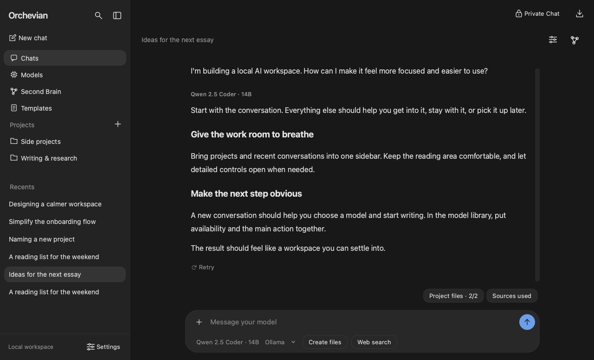
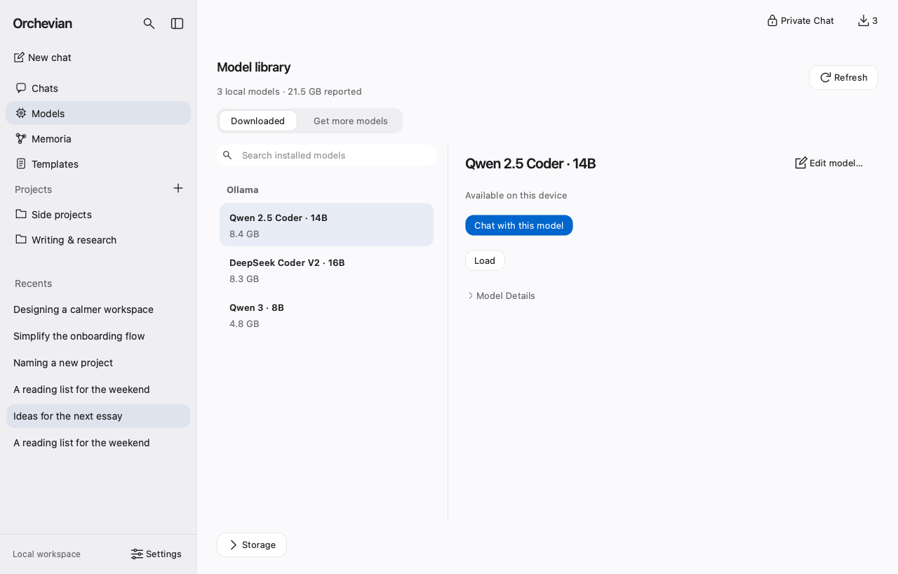
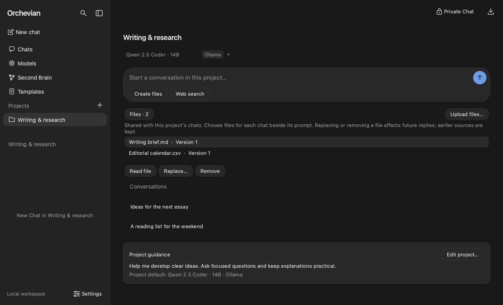

# Orchevian

**A private, local-first AI workspace for your desktop.** Run language models on your
own computer, chat with your files, create documents, search the web when you choose
to, and keep a personal knowledge base. Your conversations stay on your machine.



## Features

- **Chat with local models.** Use models from [Ollama](https://ollama.com), or run
  GGUF (llama.cpp) and MLX (Apple Silicon) models directly. Replies are formatted as
  they stream in.
- **Find and download models.** Browse Hugging Face and Ollama from inside the app,
  with suggestions sized to fit your computer's memory.
- **Projects.** Group related chats, give them shared guidance, and upload files that
  every chat in the project can draw on.
- **Chat with your documents.** Attach PDF, Word, Excel, CSV, text, Markdown, and
  images. Replies cite the passages they used. Scanned pages can be read with local
  OCR once [Tesseract](https://tesseract-ocr.github.io/) is installed.
- **Create files.** Ask for a Word document, spreadsheet, slide deck, PDF, chart, or
  data file at any point in a chat, then preview, revise, and save it.
- **Optional web search.** Turn it on for a single question. It works with no setup
  and no account; you can add your own free search key for a bigger allowance.
- **Memoria.** Useful facts from your chats become linked, editable Markdown
  notes with an interactive graph, and relevant notes are recalled in later chats.
- **Private Chat.** A session that is never saved, never remembered, and cleared
  when you close it.
- **Templates, a local API, and a command line.** Reusable starting prompts, an
  OpenAI-compatible API on `127.0.0.1`, and a terminal chat.

<p align="center">
  
  
</p>

## Install

**Download the app** from the [latest release](https://github.com/FincoDinco/orchevian/releases/latest):

- **macOS** (Apple Silicon): open the `.dmg` and drag Orchevian into Applications.
- **Windows**: run the `-setup.exe` installer.
- **Linux**: download the `.AppImage`, make it executable, and run it.

The builds aren't code-signed yet, so the first launch shows a warning; the release notes
explain how to open the app. GGUF models (and MLX models on Apple Silicon Macs) run
without anything else installed; [Ollama](https://ollama.com) is optional. Open **Models**
in Orchevian to download one.

### Run from source

To use GGUF or MLX models directly, or to develop Orchevian:

1. Install [Python 3.13](https://www.python.org/downloads/) and
   [uv](https://docs.astral.sh/uv/getting-started/installation/).
2. Install at least one model runtime. [Ollama](https://ollama.com) is the simplest
   and works on macOS, Windows, and Linux.
3. Download and start Orchevian:

   ```bash
   git clone https://github.com/FincoDinco/orchevian.git
   cd orchevian
   uv sync --extra gui
   uv run orchevian
   ```

   To run GGUF or MLX models without Ollama, add `--extra gguf` (all systems) or
   `--extra mlx` (Apple Silicon) to `uv sync`.

4. Open **Models** to download a model, then start a chat. Each model has its own
   license (shown on its download page); check it before commercial use.

How the downloads are built is described in [packaging/README.md](packaging/README.md).

## Privacy

Models run on your computer, and your chats, files, and notes are stored locally.
Orchevian connects to the internet only when you ask it to:

- **Web search**, when you turn it on for a message. Up to 500 characters of that
  question go to the search service (Exa's free search by default, or a service you
  added a key for), which may keep it under its own privacy policy. Files and saved chats
  are never sent.
- **Model browsing and downloads** from Hugging Face or Ollama.

Your data folder is private to your account, and saved search keys stay on your computer.
The local API listens only on `127.0.0.1`, is off until you enable it, and requires its own
key. See [Security](docs/security.md) for details.

## Documentation

- [User guide](docs/user-guide.md): every feature, setting, and limit.
- [Development](docs/development.md): tests, previews, real-model checks, and code layout.
- [Desktop builds](packaging/README.md)
- [Changelog](CHANGELOG.md)
- [Security](docs/security.md), [security policy](SECURITY.md), and [contributing](CONTRIBUTING.md)
- [Design](DESIGN.md): architecture and design decisions
- [License](LICENSE)

## Project status

Orchevian is approaching its 1.0 release. Remaining work:

- Release validation of the bundled runtimes on macOS, Windows, and Linux.
- Code signing and macOS notarization.
- Testing on clean machines for each platform.
- Checking generated Word, PowerPoint, and Excel files in the native Office apps.

See the [release checklist](docs/release-checklist.md) for validation evidence and
the remaining acceptance checks.

Orchevian was previously called LLM Manager. Existing chats, models, projects, and
notes carry over automatically.

## License

Copyright © 2026 Seth Hardin.

Orchevian is free software, released under the
[GNU General Public License v3.0 or later](LICENSE). You can use, study, share, and
improve it. If you distribute a modified version, it must also be free and open
source under the same license, with its source code available.
